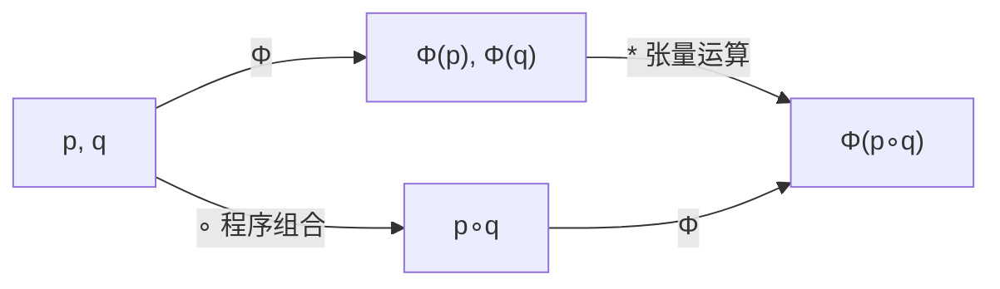

# Tenth 程序代数架构设计 ——「分析 = 函子」的机制规范

> **版本**：v1.0（设计文档，含已实现与设计两部分，逐节标注状态）
> **日期**：2026-07-31
> **状态**：✅ 可评审（对应细分规划「阶段 3-程序代数架构」）
> **读者**：编译器实现者（每个数学概念配工程解释；不预设范畴论背景）
> **关联文档**（真理源，本文件不重复搬运，只引用）：
> - `CODE_WIKI.md` §3 编译流水线、§4.3 HIR、§4.5 运行时（模块架构）
> - `MEMO.md`（逐版变更记录；本文件是设计规范，不是变更记录）
> - `docs/shape-check-roadmap/战略规划.md`（护城河 A：shape 检查 / 层 2 状态 / 层 3 lossy）
> - `程序张量探索/theory_program_tensor_algebra.md`、`theory_algebra_structure.md`（程序张量理论源头）
> - `.vscode/细分规划/阶段0-输出物-函子化验证.md`（shape 函子实测）
> - `.vscode/细分规划/阶段2a-审计报告.md`（typestate 能力缺口 G1-G6）
> - `.vscode/细分规划/阶段2b-输出物-lattice设计.md`（lossy lattice，方案 C）
> - `AUDIT.md`（缺陷登记册；阶段 2b 建议登记的盲区见其 §8，本文件不重复）

---

## 0. 摘要

**核心命题**：把「分析 = 函子」从口号变成可执行的工程规范。每一项编译期分析（shape、静默失败、状态、lossy）都是一个**从程序范畴到分析范畴的函子**；函子律（保恒等、保组合）一旦成立，**跨函数、跨组合的分析自动涌现**，不再需要全局可变收集器与手工聚合。

**结论**（诚实分级）：

| 层 | 分析 | 函子化状态 | 一句话 |
|---|---|---|---|
| 层 1 | 静默失败（丢弃 Result/Option 警告 + `or_die`/`assume_ok`） | ✅ **已实现**（局部函子，天然成立） | `lower_expr.rs` 逐块独立检查，25 项测试 |
| 层 2 | 状态 typestate | 🔲 **设计**（Tenth 现不能支撑，缺口 G1-G6） | 类型参数在编译期整体擦除，函子尚不存在 |
| 层 3 | lossy（算错可能性格） | ✅ **M1+M2 已实现**（表达式内 + 跨函数污点） | 格是链、方案 C 旁路分析；`lossy_lattice_test.rs` 9 项 + `lossy_test.rs` 25 项 |
| 层 4 | 一致性/过时 | 🔲 命名（未来） | 无设计细节，仅登记方向 |

**已验证的函子性质**（有测试证据）：字面量/静态 shape 的跨函数组合性——三层嵌套 `f(g(h()))`、泛型实例化、闭包隔离，全部由 IR 结构递归自动涌现，无需手工收集（阶段 0 重构，83+21+40 项回归全绿）。

**最关键的断点**：**符号维度（`Dim::Symbol`）不参与 unify**——`zeros(a,b)` 跨函数后仍是 `[Symbol(a), Symbol(b)]`，不与调用点实参比较，matmul/广播检查保守跳过、漏到运行时。这使"shape 函子"在符号维度上**不成立**（而字面量维度上成立）。见 §4.1。

**一句话给编译器实现者**：函子化不是重写编译器，而是**逐步收编**——把每个 pass 里的全局可变状态（收集器、顺序依赖）换成"纯结构递归 + 局部传播 + 必要时全局不动点"。阶段 0 已收编 3 处（跨函数 shape、backward_shapes、层 1 丢弃警告），层 3 的污点旁路分析（M2）已作为第 4 处收编落地（`hir/lower/taint.rs`）。

---

## 1. 程序范畴的精确刻画

> 本节继承 `程序张量探索/theory_program_tensor_algebra.md` 与 `theory_algebra_structure.md` 的形式化，并做两处**修正与补全**：(1) 定理 1.1 的合法变换刻画从"每列至多一个 1"修正为"每行至多一个 1"（源材料证明实际使用行版本，陈述与证明不一致，见 §1.3 记录）；(2) 补上 §1.5 的"保持语义/不保持语义"精确判定。

### 1.1 程序作为张量：索引表示与独热表示

设 $\mathcal{F} = \{f_1, \dots, f_n\}$ 为一组基本程序（函数/模块）。程序的**索引表示**是张量 $P \in \mathbb{R}^{I_1 \times \dots \times I_k}$，其中 $P_{i_1\dots i_k} = j$ 表示位置 $(i_1,\dots,i_k)$ 对应函数 $f_j$（`theory_program_tensor_algebra.md` §1.1）。

**工程解释**：一个程序片段 = 一串"位置"，每个位置填一个函数种类号。`[mul, add, sub]` 是 3 步程序，第 0 步是 `mul`。

**核心问题重述**（`theory_program_tensor_algebra.md` §1.2）：寻找映射 $\Phi: \text{Program} \to \text{Tensor}$ 与运算族 $\mathcal{T}$，使对任意程序组合 $\circ$ 存在张量运算 $* \in \mathcal{T}$ 满足**组合图交换**：

$$\Phi(p \circ q) = \Phi(p) * \Phi(q)$$

**工程解释**：这张图就是**函子定义**（范畴论意义下）。它说："先组合程序、再编码" 与 "先编码、再组合" 得到同一结果。分析（shape/lossy/状态）的函子化正是要求这张图在"编码 = 分析"时也交换——这是 §2 的主题。

### 1.2 程序张量空间（定义 1.1）

**定义 1.1（程序张量空间）**（`theory_algebra_structure.md` 定义 1）

$$\mathcal{P}(S, V) = \{ p \in \{0,1\}^{S \times V} \mid \forall i: \sum_j p_{ij} \le 1 \}$$

即：所有形状 $[S, V]$、**每行最多一个 1、其余为 0** 的张量集合。$S$ = 程序步数，$V$ = 词汇量（函数种类数）。

**工程解释**：每一行是一个"程序位置"的独热编码（哪个函数占了这个位置）；$p_{ij} = 1$ 表示第 $i$ 步由函数 $f_j$ 实现。行向量之和 $\le 1$ 保证每个位置要么明确指定一个函数、要么空位（no-op，用 0 向量表示，见 §1.5）。

### 1.3 合法变换（定义 1.2 + 定理 1.1 精确刻画）

**定义 1.2（合法变换）**（`theory_algebra_structure.md` 定义 2）

一个 $V \times W$ 矩阵 $T$ 是**合法变换**，当且仅当：

$$\forall p \in \mathcal{P}(S, V):\ p \cdot T \in \mathcal{P}(S, W)$$

即：$T$ 保持"每行最多一个 1"这一程序张量的结构性质。

**工程解释**：合法变换 = 对程序片段做的、保证结果仍是合法程序的变换（重排、选择、投影）。不合法变换会把程序张量变成"不是程序的东西"（例如对角缩放后每行变成小数）。

**定理 1.1（合法变换的精确刻画）**

$T \in \{0,1\}^{V \times W}$ 是合法变换 **当且仅当** $T$ 的**每一行**要么全零、要么恰有一个 1（即每行是 0 或一个标准基向量 $e_j$）。

**证明**。
($\Leftarrow$) 设 $T$ 每行至多一个 1。对任意 $p \in \mathcal{P}(S,V)$，$p$ 的第 $i$ 行至多一个 1。若第 $i$ 行在位置 $k^\*$ 有 1，则 $(p \cdot T)$ 的第 $i$ 行 = $T$ 的第 $k^\*$ 行（至多一个 1）；若第 $i$ 行全零，则结果行全零。故 $p \cdot T \in \mathcal{P}(S,W)$。
($\Rightarrow$) 反证。设 $T$ 的某行 $k^\*$ 有两个（或更多）1，位于 $j_1 \neq j_2$。取 $p$ 为单步程序（$S=1$），其唯一 1 在 $(1, k^\*)$。则 $p \cdot T$ 是 $T$ 的第 $k^\*$ 行，含两个 1，不在 $\mathcal{P}(1, W)$ 中，矛盾。故每行至多一个 1。$\square$

**记录（对源材料的修正）**：`theory_algebra_structure.md` 定理 1 的陈述为"布尔矩阵（每列至多一个 1）构成合法变换"，但其证明实际论证的是"$p_i$ 的 1 对应 $T$ 的那**一行**至多一个 1"——即**行**版本。列版本在 $p \cdot T$（右乘、行作用）下不成立（反例：$T = \begin{smallmatrix}1&1\\0&0\end{smallmatrix}$ 每列至多一个 1，但作用在 $\mathcal{P}(1,2)$ 的单行独热 $[1,0]$ 上得到 $[1,1]$，有两个 1）。本文采用行版本并给出双向证明。此修正是**形式化层面的修正**，不影响后续任何实现结论。

**推论 1.1（幺半群与群胚）**

令 $\mathcal{M}_V = \{ T \in \{0,1\}^{V \times V} \mid \text{每行至多一个 1} \}$。则：
1. $(\mathcal{M}_V, \cdot, I_V)$ 是**幺半群**（矩阵乘法封闭：行版本条件在乘法下封闭——$T_2 \cdot T_1$ 的第 $i$ 行是 $T_2$ 第 $i$ 行挑出的 $T_1$ 的某行，仍至多一个 1；结合律继承矩阵乘法；$I_V$ 是单位）。
2. 其中**可逆元恰为置换矩阵** $P_\pi$（每行每列恰一个 1）。这些可逆元构成**对称群** $S_V$，即程序范畴中的**同构群胚**（groupoid）。`theory_program_tensor_algebra.md` §2.1 的实测（置换矩阵 × 索引张量 = 程序重排）正是 $S_n$ 作为合法变换群的实例。

**工程解释**：幺半群 = "程序变换可以串联，串联仍是合法变换"。置换矩阵 = "重排步骤顺序"（不增删、不合并函数，只换位置）——这是唯一可逆的合法变换，因为只有重排能无损还原。投影/选择矩阵（行全零或独热、但非每列恰一 1）不可逆——信息被丢弃。

### 1.4 程序范畴（定义 1.3）

**定义 1.3（程序范畴）**（`theory_algebra_structure.md` 定义 3）

范畴 $\mathbf{Prog}$：
- **对象**：词汇量 $V \in \mathbb{N}$（基本程序集合的大小；工程上 = 接口/类型签名的大小）；
- **态射**：$V \to W$ 的合法变换矩阵（行零或独热），即 $\mathrm{Hom}(V, W)$；
- **恒等**：$I_V$；
- **组合**：矩阵乘法 $T_2 \cdot T_1$（对应"先应用 $T_1$、再应用 $T_2$"的顺序组合）。

**验证（范畴公理）**：
- **结合律**：$(T_3 \cdot T_2) \cdot T_1 = T_3 \cdot (T_2 \cdot T_1)$——矩阵乘法结合律，语义上"组合程序时括号方式不影响结果"；
- **单位律**：$I_W \cdot T = T = T \cdot I_V$。
- 推论 1.1 已证组合封闭。

**工程解释**：把"程序变换"组织成范畴，就获得两个免费性质：(a) 任何对程序变换的**分析**若保持组合（函子），则分析结果可局部计算、全局组合（§2）；(b) 范畴的语言（函子、自然变换）可以直接用来描述编译器 pass——这正是本文档的落点。

### 1.5 保持语义与不保持语义的运算（精确判定）

> 继承 `theory_program_tensor_algebra.md` §3 的表格，并用定理 1.1 给出精确判定。

**定理 1.2（运算语义保持的判定）**

设 $p \in \mathcal{P}(S, V)$ 是程序张量，$M$ 是作用在 $p$ 上的矩阵运算：
- $M$ 是**置换矩阵** ⟹ 保持语义（重排程序步骤，`theory_program_tensor_algebra.md` §2.1 实测）✅；
- $M$ 是**行零或独热的布尔矩阵** ⟺ 保持"是合法程序"的结构性质（定理 1.1）——语义上对应**选择/投影**（如 §3.1 例：`[mul, add, sub] × B` 选子集）✅；
- $M$ 是**对角矩阵**且对角元非 $\{0,1\}$ ⟹ **不保持**（缩放破坏二值性，结果行不再是 0/1，`theory_program_tensor_algebra.md` §3 表）❌；
- $M$ 是**正交矩阵**（非置换）⟹ 不保持（混合索引产生非二值分量，同表标 ❓，本文按定理 1.1 判为 ❌）❌。

**定义 1.4（保持语义的运算族）**——已实测确认保持语义的运算（`theory_algebra_structure.md`「已确认的运算」表）：

| 运算 | 输入 | 输出 | 语义 | 状态 |
|---|---|---|---|---|
| `reshape` | $[S,V]$ | $[S',V']$ | 重组拓扑（不改变内容编码） | ✅ 实测 |
| $P_\pi \times \text{oh}$ | 置换矩阵 × 独热 | 独热 | 程序重排 | ✅ 实测 |
| $B \times \text{oh}$ | 布尔选择矩阵 × 独热 | 独热（降维） | 程序投影 | ✅ 实测 |
| `cat(rows)` | $[S_1,V] + [S_2,V]$ | $[S_1+S_2,V]$ | 并行组合（并排） | ✅ 实测 |
| `0` 向量 | — | — | 空操作（no-op） | ✅ 实测 |

**不保持语义的运算（如实记录）**：
- **`add`（矩阵加法）在索引编码下无意义**：数值索引加法（$0+1=1$）与程序的并行组合没有内在关联——"索引的代数 ≠ 程序的代数"（`theory_program_tensor_algebra.md` §4.1）。并行组合需要**半环**结构："加法" = 并行选择、"乘法" = 顺序串联（§4.3），而数值张量运算在域 $\mathbb{R}$ 上。这是程序张量表示层的断点，见 §4.5。
- **对角矩阵（非 0/1）**：破坏二值性（定理 1.2）。
- **软独热的特殊地位**：把 $\mathcal{P}(S,V)$ 松弛为 $\tilde{\mathcal{P}}(S,V) = \{ p \in [0,1]^{S\times V} \mid \forall i, \sum_j p_{ij} = 1 \}$（每行是概率分布）后，**任何实数矩阵都成为合法变换**（概率分布的线性组合仍是分布），串联变为普通 matmul、可求导（`theory_algebra_structure.md`「关键洞察：软独热 = 可微程序」）。但软独热是**可微优化的松弛**，不是静态分析的对象——其优化存在鞍点问题（§4.3）。

---

## 2. 分析 = 函子框架

### 2.1 分析范畴与分析函子（定义 2.1 / 2.2）

**定义 2.1（分析范畴）**

对每个分析 $A$，定义其**分析范畴** $\mathbf{Anal}_A$：
- **对象**：该分析在程序接口上的抽象值（如 shape 维度、失败类型、状态集、lossiness 格元）；
- **态射**：抽象值之间的转换函数（分析意义上的传播函数）。

**定义 2.2（分析函子）**

一个**分析函子**是函子 $\Phi_A: \mathbf{Prog} \to \mathbf{Anal}_A$：
- 在对象上：$\Phi_A$ 把程序接口（类型/签名）映射到分析抽象值；
- 在态射上：$\Phi_A$ 把程序片段（态射 $f$）映射到其**分析传播函数** $\Phi_A(f)$（输入抽象值 → 输出抽象值）。

**函子律**（要求验证的数学性质）：

$$\Phi_A(\mathrm{id}) = \mathrm{id}, \qquad \Phi_A(g \circ f) = \Phi_A(g) \circ \Phi_A(f)$$

（与素材的 $\Phi(p \circ q) = \Phi(p) * \Phi(q)$ 同一等式：这里的 $\circ$ 就是那里的 $*$，组合图交换。）

**工程解释**（给实现者）：
- "分析传播函数" = `types.rs` 里 shape 推断对每个 IR 构造的**局部规则**（`If` → then ∪ else、`Call` → 被调函数的结果 shape 等）。
- "保组合" = **跨函数 shape 不需要全局遍历**：调用点的分析结果 = 被调函数的传播函数应用到实参抽象值上。分析随程序结构递归而递归。
- 反过来说：**任何需要"全局可变收集器 + 手工聚合"的分析，都违反了函子律**——那正是阶段 0 重构前 `current_fn_return_shapes` 收集器的状态（见 §2.4 证据）。

### 2.2 组合性定理（定理 2.1）

**定理 2.1（组合性定理）**

设 $\Phi_A: \mathbf{Prog} \to \mathbf{Anal}_A$ 是函子。则对任意可组合的程序片段 $f: X \to Y$、$g: Y \to Z$：

$$\Phi_A(g \circ f) = \Phi_A(g) \circ \Phi_A(f)$$

**推论 2.1（跨函数自动涌现）**：对嵌套组合 $f(g(h(\cdot)))$，$\Phi_A$ 的结果由各组件传播函数自动组合，**不需要**任何收集器、回查表或定义顺序假设（在 callee 抽象值可先获得的前提下，见 §2.3）。

**推论 2.2（局部性与错误定位）**：若 $\Phi_A(g \circ f)$ 在某个抽象值上出错，则该错误可归因于 $f$ 或 $g$ 中的某一个组件（组合是局部的）——这支撑"编译期错误带精确源码定位"的实现（阶段 0 实测：编译期 matmul shape 不兼容错误带行列号 + 源码光标，见 §2.4）。

**工程解释**：定理 2.1 是"分析 = 结构递归"的形式化依据。实现上它意味着：每个 IR 构造（Block/If/Match/Call/Closure）的分析规则局部给出，整体分析 = 这些局部规则的组合。阶段 0 的 `collect_return_tensor_dims` 正是这样一个纯递归实现（`types.rs:725`）。

### 2.3 函子性质 vs 实现时序：不动点求值（定义 2.3）

**重要区分（诚实）**：函子律 $\Phi_A(g \circ f) = \Phi_A(g) \circ \Phi_A(f)$ 是**语义等式**；但实现上要"先知道 $\Phi_A(g)$ 才能组合"。当前编译器按**程序定义顺序** lower（`resolve_call_type` 线性回查 `self.functions`，`types.rs:187`），于是：

- 若 $g$ 先于 $f$ 定义（callee 先 lower）：组合直接成立 ✅；
- 若 $f$ 先于 $g$ 定义（**前向引用**）：调用点只拿到 $g$ 的**注解签名**（`Tensor[f64, ..]` → Any），拿不到 body 精化后的 shape——组合性在结构上成立，但**顺序无关性未成立** ⚠️（阶段 0 记录，见 §4.2）。

**定义 2.3（求值策略：全局不动点）**

修复方向：全部函数 lower 完后，对函数签名做**单调不动点**重推导——第一轮用注解签名，之后每轮用上一轮的精化结果，直到稳定。这是函子律的**构造性验证**（Kleene 不动点）：每个函数的返回 shape 从注解（Any/粗）到 body 精化（细）至多精化一次，冲突坍缩到 Any（见 `join_return_dims`，`types.rs:939`），故有限轮收敛。**注意**：shape 格的 join 会把冲突坍缩到 Any（`Known(3) ⊔ Known(4) = Any`），因此不动点的单调性论证需以"信息只增不减、冲突即终态"为不变量——此分析列为阶段 1 候选，本阶段只记录（§4.2）。

### 2.4 阶段 0 实测证据（函子律验证清单）

> 证据来源：`.vscode/细分规划/阶段0-输出物-函子化验证.md`（2026-07-31，编译器部执行）。

**重构前后对比**（组合性靠手工维护 → 结构自动涌现）：

| 机制 | 重构前（违反函子律） | 重构后（函子化） |
|---|---|---|
| 跨函数返回 shape 收集 | `Lowerer.current_fn_return_shapes: Vec<Vec<Dim>>` 全局可变收集器字段，随 lowering 被 push/clear（`lower/mod.rs:44`，已删除） | `types.rs:725 collect_return_tensor_dims` 纯函数，对已 lower 的 HIR 结构递归（`&self` 之外无状态） |
| 收集时机 | Return 语句处副作用 push（`lower_stmt.rs:69` 旧） | 遍历 HIR 中所有 Return 语句，顺序无关（join 交换） |
| 调用点 shape 流 | 依赖函数定义顺序线性回查（`resolve_call_type` → `merge_return_shape`，`types.rs:187/678`） | 调用节点的 `ret_ty` 编码 callee 在调用点的结果 |
| 行为等价性保障 | — | 纯递归路径集合与旧收集器逐路径等价；`join_return_dims`/`check_and_merge_tensor_shape` 语义不变 |

**函子律成立 / 不成立的构造清单**（阶段 0 §三，测试证据）：

| 构造 | 命题 $\Phi(f \circ g) = \Phi(f) \circ \Phi(g)$ | 测试证据 |
|---|---|---|
| 函数体末表达式（隐式返回） | ✅ 由 `lowered_body.ty` 捕获 | `zeros_literal_shape_inferred` 等 |
| 显式 `return <expr>`（任意嵌套） | ✅ 结构递归找到所有 Return | 既有多 return 测试 |
| 直接调用组合（单层） | ✅ | `cross_fn_shape_propagation_*`（21 项，`cross_fn_shape_test.rs`） |
| **三层嵌套组合** $f(g(h()))$ | ✅ 自动涌现，零手工收集 | `shape_check_compile_test.rs:1417/1445/1470`（`functor_three_level_nesting_*` 3 项） |
| 泛型实例化后组合 | ✅ `substitute_type(template.return_type)` 保留精化结果 | `shape_check_compile_test.rs:1495/1513`（`functor_generic_instantiation_*` 2 项） |
| 控制流 join（If/Match/循环） | ✅ Known/Symbol 同名保留、冲突降 Any | 既有 `if_else_*`/`match_arms_*` |
| 闭包隔离 | ✅ 闭包体不参与外围 $\Phi$（修复旧缺陷：旧收集器把闭包体内 return 泄漏进外围函数） | `shape_check_compile_test.rs:1530`（`functor_closure_return_not_leaked_to_outer_fn`） |
| **前向引用（调用后定义）** | ⚠️ 结构上成立、顺序无关性未成立 | 阶段 0 §三（需不动点） |
| **符号维度**（`zeros(a,b)` → `[Symbol(a), Symbol(b)]`） | ❌ 不与调用点实参 unify | `用户反馈/shape检查体验-20260731/05_cross_fn_shape.th` 运行时报错（见 §4.1） |

**验证结果**（阶段 0 §四）：`shape_check_compile_test` 83 passed / 0 failed（重构前 77，新增 6 项函子测试）；`cross_fn_shape_test` 21 passed；`type_inference_test` 40 passed；`stdlib_test` 141 passed；全量套件退出码 0；自举 `[OK] Full compiler compiled to tenthc_full.wasm`。

**工程结论**：**命题在"静态可判定的 shape"（字面量维度）上成立，且有测试守护**；在"符号维度"上不成立（§4.1）；"前向引用顺序无关"尚未成立（§4.2）。护城河未放宽：所有既有检查保持。

---

## 3. 四层分析统一为函子

> 统一框架：每一层分析 $\Phi_A$ 都是 $\mathbf{Prog} \to \mathbf{Anal}_A$ 的函子（定义 2.2）。区别只在：$\mathbf{Anal}_A$ 的抽象值空间（对象）、分析传播规则（态射）、以及**实现状态**（已实现 / 设计 / 未来）。

### 3.1 层 1 静默失败 = 一个函子（✅ 已实现）

**分析范畴**：对象 = 表达式静态类型是否 ∈ {Result, Option}；态射 = 块内"丢弃"判定（丢弃一个 Result/Option 值 → 发出静默失败警告）。

**实现证据**（阶段 1，2026-07-31，commit 7165b94）：
- `or_die(x, msg)` / `assume_ok(x)` 自由函数 native，VM 侧 `runtime/natives.rs:228-266`、解释器侧 `runtime/interpreter/natives.rs:275-313` 双重注册（`register_all_natives` / `call_named_fn`）；HIR 白名单 `lower_expr.rs:77`、`closures.rs:35`、`eval.rs:74`；类型签名 `types.rs:437-445`（`resolve_builtin`，返回类型 = 泛型 args[0]，base 名兼容 Enum 与 TypeParam）。
- 丢弃警告：`lower_expr.rs:701-720`（Block 的**非 final** Expr 语句逐个检查）+ `lower_stmt.rs:52-75`（`check_silent_failure_discard`：类型匹配 Result/Option、`?` 显式传播排除、`or_die`/`assume_ok` 消费后类型自然非 Result 而排除）→ `TenthWarning`。
- 测试：`tenth/tests/silent_failure_test.rs`（25 项）；demo：`用户反馈/shape检查体验-20260731/11_silent_failure_demo.th`。

**函子性**：此分析是**逐块独立的局部函子**——每个 Block 的丢弃检查只依赖该块内的语句静态类型，不依赖任何跨函数状态，组合律**平凡成立**（块组合 = 警告集合的并）。它演示了"分析 = 结构递归"的工程模式：分析函数沿 HIR 结构走，无全局可变状态。

**遗留（如实记录）**：`read_line`/`env_get` 等 native 静态类型是 `Type::Enum("Result")` 无泛型参数 → `or_die(read_line(), ...)` 静态返回 Unknown（运行时正确）；"把 Result 当成功值用"（`let rows = db_query(); rows.len()`）尚未拦截（本层只做丢弃警告，error 留后续）。来源：repo memory `silent-failure-stage1.md`。

### 3.2 层 2 状态 typestate = 一个函子（🔲 设计；Tenth 现不能支撑）

**目标蓝图**：`struct File<S>` + `impl File<Open>` 特化 + `fn close(self) -> File<Closed>` 消费式转换——"非法状态转换表达不出来"。作为函子：$\Phi_{\text{state}}: \mathbf{Prog} \to \mathbf{State}$，对象 = 状态集（Open/Closed/…），态射 = 状态转换函数（`close: Open → Closed`），组合 = 状态转换链的复合。

**审计结论（阶段 2a，只读审计，未改代码）**：**Tenth 目前不能支撑 typestate**。`File<Open>` 与 `File<Closed>` 在编译期和运行期均不可区分。核心事实（`.vscode/细分规划/阶段2a-审计报告.md`，源码带行号）：

| 能力项 | 结论 | 关键源码证据 |
|---|---|---|
| 泛型 struct 声明解析/存储 | ✅ | `parser/decl.rs:73-77`、`lower_stmt.rs:159-165`（`generic_structs`） |
| **状态参数传播** | ❌ | `StructLiteral` 的 `generics: _` 直接丢弃（`lower_expr.rs:826`）；字面量类型固定 `TypeParam{name:"File"}`（`:917`）；`generic_structs` 全仓库只插入/克隆、从不消费 |
| **impl 按类型实参特化** | ❌ | `impl File<Open>` 的 `<Open>` 被 `parse_generic_params` 当作 impl 泛型参数解析（`parser/decl.rs:262-275`），且在 lowering 被 `..` 忽略（`lower_stmt.rs:256`）；方法按裸名键 `self.methods[type_name]` + mangled `__{Type}_{method}`（`lower_stmt.rs:330-364`），特化互相覆盖 |
| **self 消费式移动** | ❌ | `try_move` 定义于 `scope.rs:133` 但**全仓库零调用**；方法调用不标记 receiver Moved（`lower_expr.rs:494-554`）；实测 `f.close(); f.read()` 无错 |
| **Generic receiver 方法解析** | ⚠️ 解释器可用、VM 必挂 | `recv_type_name` 只匹配 Struct/TypeParam（`lower_expr.rs:504-506`）；VM `natives.rs:759-764` 对 Struct 只做字段访问、不查用户方法表 |
| **调用点参数类型检查** | ❌ | `resolve_fn_overload` 单签名不校验实参（`scope.rs:227` 起，`:245-249` 处直接返回）；无 `unify`，类型比较只有 `==` |

**缺口清单（G1-G6）**（阶段 2a §三，工作量：G1 小 / G2 大 / G3 中-大 / G4 中 / G5 小-中 / G6 中；依赖 G1→G2→G3 主干，G4 独立支线，G5/G6 收尾；横切项：自举同步）：
- **G1** impl 目标解析类型实参（区分 `impl<T> File<T>` 与 `impl File<Open>`）；
- **G2** impl 按类型实参特化注册（方法表/`trait_impls`/mangled 命名按（类型名+实参）分键；解释器/VM/WASM/bridge 全对齐）——**大**；
- **G3** 泛型 struct 实例化与状态传播（StructLiteral 保留 generics 构造 `Type::Generic`；`resolve_struct_type`/方法解析/参数检查识别 Generic）；
- **G4** self 消费式移动（方法签名记录 receiver 接收方式；调用点按签名标记 `Ownership::Moved`；`try_move` 接入调用链）；
- **G5** Generic receiver 方法解析 + 解释器/VM 一致性（前置修复，否则 Generic receiver 在 VM 路径必挂）；
- **G6** 调用点参数类型检查（typestate"表达不出来"的收尾保障）。

**可复用模板（诚实标注）**：`Tensor[f64, M, K]` 的 `Dim::Symbol` 是"类型携带参数并在检查中流动"的唯一现成实现（`hir/types.rs:23`、`type_parser.rs` Tensor 专用解析、`lower/types.rs` 同名匹配流动）——语义上最接近 typestate 需要的"状态参数匹配"，可作为设计模板；`substitute_type` 已支持 `Type::Generic`（`lower/mod.rs:268`），泛型函数实例化管线（模板查找→type_map→soundness 检查→mangled 实例化）可复用（`lower_expr.rs:419-486`）。区别：Tensor 是内置变体 + 专用检查函数，typestate 需要把同等能力给用户 struct 的类型实参。

**函子性状态**：对象与态射（状态集与转换）在语言里**尚不存在**（类型擦除）——函子 $\Phi_{\text{state}}$ 是**目标蓝图**而非现状描述。落地即 G1-G6。

### 3.3 层 3 lossy = 一个函子（✅ M1+M2 已实现；M3 shape 协同未实现）

**分析范畴（lossy lattice）**（`.vscode/细分规划/阶段2b-输出物-lattice设计.md` §1.1）：

$$L = \{\text{Exact} \prec \text{PossibleOverflow} \prec \text{PossibleNaN} \prec \text{Lossy}\}$$

**引理 1（格结构）**：$(L, \preceq)$ 是链（全序），故是分配格；join $\sqcup$ = 取最损者（max），meet $\sqcap$ = 取最小者。**证明**：$|L|=4$ 且线性序，任意两元素有唯一上/下界（max/min）；max/min 满足结合、交换、幂等、吸收律。$\square$

**工程解释**：链式格保证 join 传播**单调且幂等**——同一污点重复参与不升级。传播规则：**结果污点 = 左污点 ⊔ 右污点 ⊔ 算子静态效应**。**防误报第一原则**：只有编译期可静态判定的算子效应才计入 `op_effect`；运行时才可能发生的（"变量 y 恰好为 0"）不计入——宁可漏报（污点缺失），不可误报（把 Exact 污成 Possible）。

**实现状态**：
- **M1 已实现**（编译期零除数 spike）：`types.rs:1135 is_statically_zero`（字面量零 + 一元负号包裹）+ `types.rs:1154 check_binary_static_divzero`（Div/Mod + 右操作数静态为零 → TypeError）；`lower_expr.rs` Binary 两个默认分支（无运算符重载实现）接入；运算符重载生效的分支不检查（尊重用户自定义语义）。测试：`tenth/tests/lossy_lattice_test.rs`（9 项：错误类 5 + 防误报类 4）；demo：`用户反馈/shape检查体验-20260731/12_lossy_lattice_m1_demo.th`。
- **M2 已实现**（2026-07-31）：`lossy` 关键字全链路（lexer/parser/HIR 双侧同步 + 语言参考手册 §10.5）；**方案 C 旁路分析**（`hir/lower/taint.rs`：`Lossiness` 格 + `expr_taint` 结构递归 + `fn_call_taint` 实参敏感跨函数传播，`Type` 零侵入）；使用点检查（只对静态确定的 Lossy 在 println/to_string 等 sink 报错，提示 `lossy(...)`）；HIR 加 `HirExprKind::Lossy`（bytecode/wasm/解释器编译为 inner=no-op，运行时零开销）。测试：`tenth/tests/lossy_test.rs` 25 项 + 全量 1511 passed / 0 failed；自举 `[OK]`。
- **M3 未实现**（设计要点）：与 shape 检查协同（shape 全已知时张量级判零精确化）；`backward_shapes.rs` 已函子化（阶段 0），污点传播可复用同样纯递归结构。

**函子性**：$\tau: \mathbf{Prog} \to L$ 的传播规则是**逐节点局部**的（结构递归）——这是"分析 = 函子"最纯粹的例子，组合律在表达式树局部天然成立。**M2 已打通函子的跨函数组合**：调用点结果 = 被调函数返回污点 ⊔ 实参污点（`fn_call_taint` 实参敏感 + memo 化递归），$\Phi_{\text{lossy}}$ 在函数边界上成立（有测试证据：`lossy_test.rs` 的 `cross_function_*` 与 `cross_function_chain_propagates` 三层嵌套 f(g(h()))）。局限：递归/互递归函数保守返回 Exact（未做不动点）；方法调用不查 callee 返回污点（只 receiver⊔args）；泛型实例化 body 不参与（防误报）。

**精度降级审计（layer 3 的现实来源）**（阶段 2b §4）：标量-标量混合是提升、张量-张量混合是提升；**唯一现实存在的语言级静默降级路径 = 标量 ×/±/÷ 张量**（标量被静默 cast 到张量 dtype，如 `f16_tensor * 1.23456789012345`；`runtime/tensor/methods.rs` 的 `add_scalar/sub_scalar/mul_scalar/div_scalar` 及 VM `execute.rs` 同构）。类型静态已知、触发可判定、误报风险为零 → 这是 Lossy 污点最干净来源。**修正**：规划文档曾以 `x as f32` 为 Lossy 示例，审计认为显式 `as`/`to_f32` 是用户意图（类比 Rust 的 `as`），不应自动标记；应标记的是**隐式**标量→张量 dtype 收缩。

### 3.4 层 4 一致性 / 过时 = 一个函子（🔲 命名，未来）

无实现、无设计细节。登记方向：一致性分析检测"同一符号在不同作用域/模块的过时定义"（类似 typestate 的状态一致性检查）；作为函子 = 从 $\mathbf{Prog}$ 到一致性格的函子。**本阶段只命名并归位，不承诺**。

### 3.5 四层统一对照表

| 层 | 分析 | 抽象值空间（对象） | 传播规则（态射） | 函子化实现状态 | 证据 |
|---|---|---|---|---|---|
| 1 | 静默失败 | {Result, Option} × {丢弃?} | 块内丢弃判定 | ✅ 已实现（局部函子） | `silent_failure_test.rs` 25 项；`lower_expr.rs:701-720` |
| 2 | 状态 typestate | 状态集（Open/Closed） | 状态转换函数 | 🔲 设计（G1-G6 未落地） | 阶段 2a 审计报告（4+4 实测 + 源码行号） |
| 3 | lossy | 链式格 $L$（4 元） | $\tau(\text{op}) = t_l \sqcup t_r \sqcup \text{op\_effect}$ | ✅ M1+M2 已实现（跨函数） | `lossy_lattice_test.rs` 9 项 + `lossy_test.rs` 25 项；`taint.rs` |
| 4 | 一致性/过时 | 一致性格（未定义） | — | 🔲 命名 | — |

---

## 4. 诚实记录：代数断点

> 本节是"不美化"清单。每个断点给：现状（含证据）、根因、可能出路、当前状态。

### 4.1 断点 1：符号维度 unify（最关键的断点）

- **现状**：`zeros(a,b)` → `[Symbol(a), Symbol(b)]`（`hir/types.rs:23 Dim::Symbol`；`types.rs` `shape_from_int_args` 变量参数分支）。跨函数/跨调用时 matmul/广播检查**保守跳过**，漏到运行时。实测 `用户反馈/shape检查体验-20260731/05_cross_fn_shape.th`：重构前后一致地运行时报 `matmul shape mismatch: [3, 4] @ [5, 6]`（**未变差**，但仍是运行时才报）。
- **根因**：`Symbol` 未与调用点实参 unify——`zeros(a,b)` 被 `make(3,4)` 调用后仍是 `[Symbol(a), Symbol(b)]`，不与 `[5,6]` 比较。本质是"类型携带参数"（Symbol 是参数化维度）缺"参数代换"（调用点实参替换）。
- **影响**：shape 函子（§2）在符号维度上**不成立**——这是函子性质验证清单里唯一被判 ❌ 的构造（阶段 0 §三）。
- **可能出路**：调用点实参代换（substitution）——把 callee 的 Symbol 维度替换为实参维度后比较；或符号统一（unification，类似 Hindley-Milner 的 metavariable 求解）。`substitute_type`（`lower/mod.rs:268`）已有 Generic 替换能力，可借鉴。列为阶段 1 候选。

### 4.2 断点 2：前向引用顺序无关性

- **现状**：调用后定义的同文件函数，调用点只拿到**注解签名**（`Tensor[f64, ..]` → Any），拿不到 body 精化 shape。`resolve_call_type`（`types.rs:187`）线性回查 `self.functions`（程序顺序）。
- **根因**：组合性在**结构上**成立（若 callee 先 lower 则自动成立），但**顺序无关性**未成立——实现按程序顺序做局部组合，不做全局不动点。
- **可能出路**：全函数 lower 完后做单调不动点（fixpoint）重推导签名（定义 2.3）。列为阶段 1 候选；本阶段不实施以免改变既有行为（阶段 0 §三）。
- **诚实标注**：不动点的收敛依赖"信息只增不减、冲突坍缩到 Any 为终态"（`join_return_dims`，`types.rs:939`）；其形式化收敛证明未完成（见 §6 局限）。

### 4.3 断点 3：鞍点（可微程序搜索）

- **现状**（`程序张量探索/step6_findings.md`）：程序张量方法（软独热 + autodiff 搜索程序结构）在**当前实现**中卡在鞍点——500 步梯度找不到解；同规模穷举 9 次评估即找到 `(add1, mul2) MSE=0`。
- **原因**（step6 §原因分析）：(1) softmax + 对称损失 → 梯度消失；(2) 程序张量矩阵从均匀分布出发时所有操作概率相等；(3) "加权和→加权和"的 2 层结构中梯度对称性导致无法逃离鞍点。
- **教训**（step6 §步骤5成功的原因）：步骤 5 训练的是**连接矩阵 W**（操作间转移概率）而非直接训练程序矩阵 P；且其数据中操作输出值差异足够大（13 vs 30 vs 7），提供清晰梯度信号。**诚实结论**：程序张量方法理论上在大搜索空间有指数级优势（$O(\text{iters})$ vs $O(\text{ops}^{\text{steps}})$），但前提是解决优化鞍点问题——需要打破对称性的参数化方案（训练 W 而非 P）与损失函数（对比学习、policy gradient 替代 MSE）。
- **与函子框架的关系（重要，防止混淆）**：可微程序搜索是"**程序作为数据**"的**逆问题**（学习/优化程序结构）；"分析 = 函子"是**编译期静态分析**（程序作为结构、分析作为同态）。两者是**正交的两条轨道**——鞍点是优化轨道的断点，不阻塞分析轨道的函子化。

### 4.4 断点 4：typestate 类型擦除

- **现状**：泛型 struct 的类型参数在编译期被整体擦除（§3.2 证据表）：字面量 `generics` 被丢弃（`lower_expr.rs:826`）、`generic_structs` 从不实例化、impl 方法按裸类型名注册且互相覆盖（`lower_stmt.rs:330-364`）、方法调用不产生消费式移动（`try_move` 零调用，`scope.rs:133`）、参数类型不检查（`scope.rs:245-249`）。`File<Open>` 与 `File<Closed>` 编译期/运行期均不可区分（运行期 `Value::Struct{name: String, fields}` 只存裸名，`runtime/value.rs:123`）。
- **根因**：类型系统把"类型实参"当作可丢弃的模板装饰，而非参与检查的语义对象。
- **可能出路**：G1-G6（§3.2）。若只做 File/TCP 两个场景、不做通用泛型扩展，可把 G3 裁剪为"仅结构体类型实参参与方法特化与返回类型注解匹配"的窄实现，工作量降一档（阶段 2a §五）。
- **诚实标注**：这是四层中离实现最远的一层；函子 $\Phi_{\text{state}}$ 目前是蓝图。

### 4.5 断点 5：程序张量的"加法"语义（半环缺口）

- **现状**：数值索引的加法（$0+1=1$）与程序的并行组合没有内在关联——**索引的代数 ≠ 程序的代数**（`theory_program_tensor_algebra.md` §4.1）。程序组合的代数结构通常是**半环**（"加法" = 并行选择、"乘法" = 顺序串联，§4.3），而数值张量运算在**域** $\mathbb{R}$ 上。
- **影响**：§1.5 中"add 无意义"的根源；程序张量表示层的语义运算族受限于此。
- **可能出路**（theory §5 方向表）：布尔矩阵在独热编码上的行为（不依赖数值后端，独热张量仍是 f64 张量）；半环张量网络（需改动数值后端，成本最高）；范畴论形式化（张量化函子）。其中**布尔矩阵在独热编码上的行为**是实验 3（置换矩阵）的直接推广，成本最低。
- **与函子框架的关系**：此断点在"程序张量化"轨道；"分析 = 函子"直接作用于 HIR 结构，**不依赖**程序张量化落地。

---

## 5. 编译器落地路径

### 5.1 原则：逐步收编而非重写

**函子化不是推翻现有编译器**：它是对现有 pass 的重构模式——把"全局可变收集器 + 顺序依赖 + 手工聚合"换成"纯结构递归 + 局部传播 + 必要时的全局不动点"。每个 pass 独立判定是否函子化，独立落地，独立测试守护。用户无感（用户只看到错误被拦住了、且拦截得更早）——**架构不是卖点，函子是内部机制**（规划 §四）。

### 5.2 已函子化清单（有代码证据）

| # | 分析 | 函子化方式 | 证据 |
|---|---|---|---|
| 1 | 跨函数 shape 求解 | 删除 `current_fn_return_shapes` 全局收集器（`lower/mod.rs:41` 注释留存），改 `types.rs:725 collect_return_tensor_dims` 纯递归 | 阶段 0 验证（83+21+40 全绿 + 6 项函子测试） |
| 2 | backward shape pass | 纯递归结构（阶段 0 提及，`backward_shape_pass.rs`） | 阶段 2b §6 M3 引用 |
| 3 | 层 1 丢弃警告 | 逐块独立检查（`lower_expr.rs:701-720`、`lower_stmt.rs:52-75`），天然局部函子 | `silent_failure_test.rs` 25 项 |
| 4 | 层 3 M1 静态错误 | 表达式局部检查（`types.rs:1135/1154`） | `lossy_lattice_test.rs` 9 项 |

### 5.3 函子化通用模式（5 步，给实现者）

1. **识别反函子信号**：pass 里有全局可变收集器字段（`Vec<...>` 被 push/clear）、结果依赖遍历顺序、调用点回查全局表拿"上一个函数的中间结果"——这些都是"组合性靠手工维护"的标志（阶段 0 §一 列了 3 处）。
2. **定义范畴与函子**：该分析的抽象值空间（对象）、传播规则（态射）、组合律——先写清楚 $\Phi_A(g \circ f) = \Phi_A(g) \circ \Phi_A(f)$ 在该分析里具体是什么。
3. **纯函数化**：把收集器换成纯函数结构递归（对已 lower 的 HIR/AST），触发时机改为组合式（lower 完某结构后调用纯函数）。
4. **处理跨函数信息**：若需要 callee 精化结果，用不动点（定义 2.3）而非程序顺序——当前前向引用仍按顺序（断点 4.2）。
5. **测试守护函子律**：三层嵌套 `f(g(h()))`、泛型实例化、闭包隔离、多 return join——每个新函子配同构测试（参照 `shape_check_compile_test.rs:1417-1530` 的 6 项模式）。

### 5.4 候选函子化（按优先级）

| 优先级 | 候选 | 依据 | 前置 |
|---|---|---|---|
| 高 | 层 3 M2 污点旁路分析（`var_taint` + `expr_taint` 结构递归 + 函数返回污点） | 方案 C 已选定（阶段 2b §1.2），纯编译期、零 `Type` 侵入 | M1 已就绪；`lossy` 关键字需 lexer/parser/HIR 双侧同步 |
| 中 | 层 2 typestate（G5 → G1+G2+G3 → G4 → G6） | 审计报告 §五 建议顺序 | G5 独立快赢（解释器/VM 一致性） |
| 低 | 断点 4.1 符号维度 unify（调用点实参代换） | 阶段 0 列为阶段 1 候选 | 需先明确代换/统一语义 |
| 低 | 断点 4.2 前向引用不动点 | 阶段 0 列为阶段 1 候选 | 需先完成收敛性论证 |

### 5.5 IR 结构如何承载函子（分层原则）

**核心原则：分析层 ≠ 表示层。** 不同分析的抽象值是否需要进入 IR/类型/运行时，取决于该抽象值是否需跨边界或进运行时：

| 抽象值 | 是否进 `Type` | 是否进 HIR/bytecode | 理由 |
|---|---|---|---|
| shape（维度） | ✅ 进 `Type::Tensor` 的 dims（`Dim::Known/Symbol/Any`，`hir/types.rs:22-25`） | 编译期即可 | 需跨函数边界、参与 matmul/广播检查 |
| lossiness | ❌ 不进（方案 C 旁路表） | ❌ 运行时 no-op | 纯编译期构造；为它付出全 `Type` 破坏性改造成本不成比例（`Type` 20+ 变体、构造点 100+ 处，阶段 2b §1.2 评估） |
| 状态参数 | ✅ 应进 `Type::Generic`（设计蓝图） | 编译期特化（运行期无状态字段，`Value::Struct` 只存裸名 `runtime/value.rs:123`） | 需参与方法解析/参数检查（"表达不出来"的前提）；当前被擦除（断点 4.4） |

**反面教材（诚实记录）**：`Dim::Symbol` 形态上是"类型携带参数"的好模板，但属性语义不同——shape 需跨边界/进运行时（所以值得嵌入 `Type`），lossiness 不需要（所以旁路）。**模板可借鉴形态，不可照搬语义**（阶段 2b §1.2）。

---

## 6. 局限（独立章节，诚实披露）

1. **组合性定理的验证范围**：函子性质只在**静态可判定的 shape**（字面量维度）上实测成立（§2.4）；符号维度（`Dim::Symbol`）上不成立（断点 4.1），Any 维度上未验证。定理 2.1 是数学陈述，其**工程实例**的覆盖度由测试清单限定，不宣称全语言成立。
2. **层 3 已实现（M1+M2）**：$\Phi_{\text{lossy}}$ 的表达式内（M1）与跨函数组合（M2，`fn_call_taint` 实参敏感）均已打通，有 34 项测试守护。遗留：递归函数保守 Exact、方法调用不查 callee、泛型实例化跳过（均如实记录于 §3.3）。
3. **层 2 完全未实现**：$\Phi_{\text{state}}$ 是蓝图；Tenth 现不能支撑 typestate（G1-G6）。本文档对层 2 的描述是"目标规范"，不是"现状"。
4. **不动点收敛性已论证并实施（2026-08-02/03）**：断点 4.2 全局不动点已落地（`run_forward_ref_shape_fixpoint`，`lower_program` 尾部）。收敛性论证见 `docs/shape-check-roadmap/前向引用断点收敛性论证.md`——**纯前向引用（无递归）严格收敛且顺序无关**（定理 3 + n=3 穷举 17,568 个无环程序 100% 实证）；**递归场景确不成立**（存在震荡反例：`f0=f1(); f1=Join(K1,f2); f2=Join(K2,f0)` 进入周期 3），工程实现按 **2n+1 轮上限回退首轮**（SCC 感知为可选强化）；`join_return_dims` 已改 **n 元共识语义**消除折叠顺序依赖。遗留：递归程序不动点收敛但可能依赖定义顺序（论证报告推论 4.1），true letrec/递归 shape 精化为后续候选。
5. **程序张量优化存在鞍点问题**：断点 4.3；若未来"程序张量研究 + 函子框架"论文合流（规划 §四 可选里程碑），必须如实披露可微程序搜索当前不可用（step6 诚实结论）。
6. **半环结构未落地**：程序张量表示层的"加法 = 并行选择"仍是理论方向（断点 4.5），未进入任何实现。
7. **传播规则完备性不可穷举证明**：层 3 的"污点覆盖所有静默算错路径"依赖逐算子审计（阶段 2b §7.7 已披露未审计区域：`natives` 内标量/常量处理未逐行审计）；本文档继承该披露，不重复列举。
8. **层 4 仅有命名**：一致性/过时分析无对象/态射/传播规则定义，属于方向登记，不承诺能力。

---

## 7. 结论与实施建议

1. **核心结论**：「分析 = 函子」已在**层 1（静默失败）与 shape 函子**上落地为可执行机制，有测试守护；层 3 已落地表达式局部（M1），跨函数（M2）是下一个落地目标；层 2 是蓝图；层 4 是命名。
2. **最关键的断点是符号维度 unify（断点 4.1）**：它决定 shape 函子能否从"字面量维度成立"推广到"参数化维度成立"。建议作为阶段 1 的第一个候选，与层 3 M2 并列优先级。
3. **实施建议（按序）**：
   - 层 3 M3：与 shape 检查协同（shape 全已知时张量级判零精确化）；M2 已完成（lossy 关键字 + 方案 C 旁路分析 + 函数返回污点传播——lossy 函子的跨函数组合已打通）。
   - 断点 4.1：调用点实参代换（Symbol → 实参维度），复用 `substitute_type` 模式；需新增测试（`zeros(a,b)` 被 `make(3,4)` 调用后与 `[5,6]` 比较）。
   - 断点 4.2：全局不动点重推导签名 **已完成**（2026-08-03，`run_forward_ref_shape_fixpoint` + 2n+1 轮上限兜底；收敛性论证见 `docs/shape-check-roadmap/前向引用断点收敛性论证.md`——无环严格收敛且顺序无关，递归需上限/SCC 回退）。
   - 层 2：按审计报告 §五 顺序（G5 → G1+G2+G3 → G4 → G6），每步双侧同步（自举）。
4. **对真理源的连接**：本文档是设计规范，不是变更记录；落地实施后的变更记入 `MEMO.md`、能力状态变化记入 `能力梳理/能力全梳理.md`、缺陷登记 `AUDIT.md`（阶段 2b 已建议登记的 3 项盲区：NaN 比较静默、JIT 整数溢出路径未统一检查、标量→张量降级 natives 未逐行审计——见阶段 2b §8）。

---

## 附录 A：符号与证据索引

**范畴论符号**：$\mathbf{Prog}$ 程序范畴；$\Phi_A$ 分析函子；$\mathcal{P}(S,V)$ 程序张量空间；$\circ$ 程序组合 / 函数复合；$*$ 张量运算；$L$ lossy 格；$\sqcup/\sqcap$ 格 join/meet；$\preceq$ 格偏序。

**代码证据索引**（`tenth/src/` 下）：

| 断言 | 证据 |
|---|---|
| shape 函子纯递归实现 | `hir/lower/types.rs:725`（`collect_return_tensor_dims`）、`:939`（`join_return_dims`）、`:678`（`merge_return_shape`）、`:187`（`resolve_call_type`） |
| 收集器已删除 | `hir/lower/mod.rs:41`（注释留存）、`:268`（`substitute_type` 支持 Generic） |
| 层 1 or_die/assume_ok | `runtime/natives.rs:228-266`（VM）、`runtime/interpreter/natives.rs:275-313`（解释器）、`hir/lower/types.rs:437-445`（类型签名）、`lower_expr.rs:77`/`closures.rs:35`/`eval.rs:74`（白名单） |
| 层 1 丢弃警告 | `lower_expr.rs:701-720`（Block 非 final 语句）、`lower_stmt.rs:52-75`（`check_silent_failure_discard`） |
| 层 3 M1 | `hir/lower/types.rs:1135`（`is_statically_zero`）、`:1154`（`check_binary_static_divzero`） |
| 层 2 类型擦除 | `lower_expr.rs:826/917`（StructLiteral generics 丢弃/类型固定）、`lower_stmt.rs:159-165/256/330-364`（generic_structs/impl 忽略/裸名键）、`scope.rs:133/245-249`（try_move 零调用/单签名不检查）、`lower_expr.rs:504-506`（recv_type_name）、`runtime/value.rs:123`（Struct 裸名） |
| 符号维度 | `hir/types.rs:23`（`Dim::Symbol`） |

**测试证据索引**（`tenth/tests/` 下）：`shape_check_compile_test.rs:1417-1530`（6 项 functor 测试）、`cross_fn_shape_test.rs`（21 项）、`silent_failure_test.rs`（25 项）、`lossy_lattice_test.rs`（9 项）、`type_inference_test.rs`（40 项）、`stdlib_test.rs`（141 项）。

**实测文档索引**：`用户反馈/shape检查体验-20260731/05_cross_fn_shape.th`（符号维度漏到运行时）、`05b_cross_fn_literal.th`（字面量跨函数编译期拦截）、`11_silent_failure_demo.th`、`12_lossy_lattice_m1_demo.th`。

## 附录 B：术语表（数学概念 ↔ 工程概念）

| 数学概念 | 工程对应 |
|---|---|
| 范畴对象 | 程序接口/类型签名（或词汇量） |
| 范畴态射 | 程序片段（函数/组合） |
| 组合 $\circ$ | 顺序组合（调用/串联） |
| 函子 $\Phi_A$ | 一项编译期分析（shape/lossy/状态…） |
| 函子律保组合 | 跨函数分析自动涌现、无需全局收集器 |
| 合法变换（行零或独热） | 重排/投影/选择程序片段的矩阵 |
| 置换矩阵 = 同构 | 可逆的程序重排（无损变换） |
| 半环（加法=并行、乘法=串联） | 程序组合的代数结构（理论方向） |
| 软独热 | 可微的程序结构松弛（训练用，非静态分析对象） |
| 格 join | 分析结果取"最损/最不精确"者合并 |
| 不动点求值 | 跨函数信息的前向引用修复（阶段 1 候选） |
