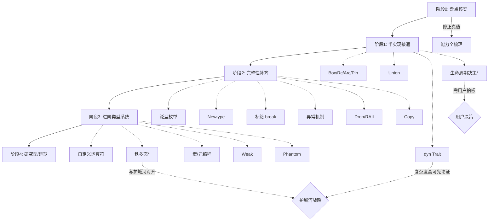

# 语言核心补全方案（总师规划）

> 版本：v1.0 | 日期：2026-08-01 | 总师：tenth-chief-architect
> 状态：**待用户审批**（复杂任务，审批通过后按阶段委派执行）
> 范围：从"当前状态"到"语言核心设计全部完成"（能力全梳理 §1 的 5 大块：词法语法 / 类型系统 / 控制流 / 函数闭包 / 内存所有权）

---

## 〇、方案摘要

**核心判断：语言核心的真实缺口远小于能力全梳理.md 所标注的 44 项 ❌。**

源码核实发现（2026-08-01）：
- 2026-07-13 已补齐的语言核心语法 20 项缺口（字符字面量/原始字符串/多行字符串/字节串/运算符重载/函数重载/默认/命名/可变参数/break 带值/do-while/TCO/柯里化/定长数组/#[test] 等）在能力全梳理中**仍标 ❌**——文档滞后 20 项。
- 基本功核查 v2.5 又纠正 3 项误判：默认 trait 方法 ✅、关联类型 `type Item;` ✅、Never 类型 ✅。
- **代码超前于文档**：`hir/types.rs` 的 `Type` 枚举已含 `Dyn`/`Union`/`HeapBox`/`SharedBox`/`AtomicBox`/`Pin`/`Never`/`Range`/`Array` 变体；`runtime/value.rs` 已含 `Value::HeapBox`/`SharedBox`/`Pin`/`Union`；`parser/type_parser.rs` 已解析 `&'a T` 生命周期与 `dyn Trait`；`parser/decl.rs` 已解析 `union` 声明；native `box`/`pin` 已注册——但**全部无测试、无标准库暴露、状态不明**（疑似早期探索遗留的半实现）。

**因此方案第 0 阶段是"盘点核实"**：先把真实状态摸清、把能力全梳理 §1 修正为真值，再基于真实缺口分阶段补齐。不做这一步，方案就建立在失真数据上。

**预计工作量**：核实（1 批次）→ 半实现接通（4 项）→ 语言完整性补齐（6 项）→ 进阶类型系统（4 项）→ 研究型/远期（明确标记可选，不设硬性完成线）。

---

## 一、总原则（约束）

1. **真理源同步**：每个任务完成必须同步 `能力梳理/能力全梳理.md`（状态真值）+ `MEMO.md`（变更记录）+ `docs/语言参考手册.md`（语法权威）+ `AUDIT.md`（缺陷登记）。
2. **自举三路径不破坏**：路径 A（Rust 全栈）/ B（Tenth 前端 + Rust 后端）/ C（全 WASM 闭环）。涉及语法/关键字新增的任务必须评估 tenthc 同步。
3. **护城河不破坏**：shape 检查、lossy 格、typestate、静默失败告警等既有护城河保持全绿（当前 1584 passed）。
4. **防误报底线**：所有新增类型检查沿用"只对确定不兼容报错"的保守策略（typestate G6 先例）。
5. **执行方式**：总师出方案 → 用户审批 → 按阶段委派部门 subagent → 测试部验证 → 总师终审。
6. **顺序依赖**：阶段 0（核实）必须先于一切；阶段 1（接通）先于阶段 2（新增）；阶段 3 需数理部先行论证；阶段 4 可选。

---

## 二、阶段 0：语言核心现状盘点核实（地基）

> 目的：把能力全梳理 §1 从"失真 44 ❌"修正为"真值"，产出精确缺口清单。
> 规模：中等（跨编译器部/测试部/文档部，但每项是只读核实）。

### 任务 0.1：逐项源码核实（编译器部 + 测试部）

对能力全梳理 §1 全部条目，按"四层管线 + 测试"标准判定：

| 判定 | 标准 |
|------|------|
| ✅ 全链路 | Lexer→Parser→HIR→VM/解释器→WASM/JIT 全通 + 有测试 |
| ⚠️ 半实现 | 至少一层缺（如 Type 变体有、语法没接 / 语法有、运行时没接） |
| ❌ 无 | 全链路无 |

**已知需重点核实的"超前实现"清单**（本方案已发现的存疑项）：

| # | 特性 | 已发现证据 | 待核实 |
|---|------|-----------|--------|
| A | Box/Rc/Arc/Pin | Type 变体 + Value 变体 + native `box`/`pin` 已注册 | 语法（`Box<T>` 注解/`box(x)` 调用）是否通？有无方法（`deref`/`clone`）？JIT/WASM 是否支持？ |
| B | Union 类型 | `union Name { f: T }` 声明已解析 + `Type::Union` + `Value::Union { name, active_field, value }` | 构造/字段访问/match 匹配是否通？内存重叠语义是否实现？ |
| C | dyn Trait | `dyn TraitName` 类型已解析 + `Type::Dyn` | vtable/动态调用是否实现？还是仅类型占位？ |
| D | 生命周期 | `&'a T` 语法已解析 + `Type::Ref(_, Option<String>)` | 借用检查器是否消费 lifetime？还是仅语法透传？ |
| E | 异常机制 | `try` 块 VM 后端已通（基本功核查 #2） | `catch` 语法/异常值传播是否完整？ |
| F | 宏 | lexer 有 `Macro` token | parser 是否处理？还是死 token？ |
| G | 关联类型 | `type Item;` 已解析（误判纠正） | 实例化时绑定是否生效？有无测试？ |
| H | 默认 trait 方法 | TraitMethod.body 已支持 | 默认实现回退是否生效？ |

### 任务 0.2：文档修正（文档部）

- 修正 `能力梳理/能力全梳理.md` §1 全部滞后条目（含 2026-07-13 的 20 项 + 基本功核查 3 项误判 + 本方案发现的超前实现）。
- 更新 §9 总结矩阵"语言核心设计"行。
- `MEMO.md` 记录本次盘点。
- `docs/语言参考手册.md` 同步已接通特性。

### 交付物

- 更新后的能力全梳理 §1（真值版）
- **真实缺口清单**（本方案后续阶段的依据，若有出入以 0.1 结果为准）

---

## 三、阶段 1：半实现特性接通（低风险，高确定性）

> 针对阶段 0 确认的 ⚠️ 半实现项，逐项接通到全链路 + 补测试 + 暴露到标准库。
> 每项：编译器部/运行时部实施，测试部补测试，文档部同步。

### 任务 1.1：Box/Rc/Arc/Pin 全链路接通
- **目标**：`Box<T>`/`Rc<T>`/`Arc<T>`/`Pin<T>` 可作为类型注解；`box(x)`/`rc(x)`/`arc(x)`/`pin(x)` 构造 native；提供 `deref`/`clone` 等基础方法；解释器 + VM 双路径。
- **影响模块**：`parser/type_parser.rs`（`Box<T>` 等注解语法）、`hir/lower/*`、`runtime/value.rs`、`runtime/natives.rs` + `interpreter/natives.rs`、`compile/bytecode.rs`、`compile/jit/*`（不支持则 fallback）、`compile/wasm/*`（不支持则 Err 兜底）。
- **自举影响**：无新关键字，tenthc 无需同步（Type 注解属能力扩展）。
- **验证**：新增 `smart_ptr_test.rs`（构造/解引用/类型检查/VM+解释器 parity/JIT fallback）。

### 任务 1.2：Union 类型全链路接通
- **目标**：`union` 声明 → 构造/字段访问/match 匹配全通；明确内存重叠语义（或保守实现为 tagged union 并如实标注）。
- **影响模块**：`parser/decl.rs`（已有声明解析）、`parser/expr.rs`（构造/访问语法）、`hir/lower/*`、`runtime/value.rs`、VM/解释器。
- **验证**：`union_test.rs`（声明/构造/访问/match/类型检查）。

### 任务 1.3：dyn Trait 动态分发接通
- **目标**：`dyn Trait` 值构造 + 通过 trait 方法动态调用（vtable 或等效机制）。
- **前置**：若实现复杂（vtable 布局），可先由数理部出可行性方案。
- **验证**：`dyn_trait_test.rs`（多实现动态分派/类型检查）。

### 任务 1.4：生命周期语义化决策
- **目标**：核实 `&'a T` 的 lifetime 当前是否被借用检查器消费。两种结局：
  - 若已消费 → 补测试 + 文档。
  - 若仅透传 → **决策点**：引入显式 lifetime 检查（工作量中等）或明确"Tenth 借用检查为语句粒度近似，不实现显式 lifetime"（如实标注 ❌ 为设计取舍，参照 GC/goto 先例）。**此项需用户拍板**。

---

## 四、阶段 2：语言完整性补齐（中等风险）

> 针对阶段 0 确认的 ❌ 项中"正常语言必需"的部分。每项独立可交付。

### 任务 2.1：泛型枚举显式 `<T>` 语法
- **目标**：`enum Option<T> { Some(T), None }` 显式类型参数声明（当前靠推断）。
- **影响**：`parser/decl.rs`（enum 泛型参数）、`hir/lower/*`（实例化 mangled 名）、tenthc 同步评估。
- **状态**：✅ **已完成（2026-08-01 M2.1）**。`enum Box<T> { Value(T), Empty }` 声明 + `Box<i64>::Value(42)` 显式实参构造 + `Box::Value(42)` 推断构造 + match 解构字段类型替换 + 嵌套泛型 `Wrap<Vec<i64>>` + 泛型函数交互 + 穷尽性 + shadow 内置 Option；tenthc 语法层可解析 `enum X<T>` 声明（语义不特化）。详见 `MEMO.md` 2026-08-01 M2.1 条目、`能力梳理/能力全梳理.md` §1.2 泛型枚举 ✅。

### 任务 2.2：Newtype 模式（tuple struct）
- **目标**：`struct Meters(f64)` 单字段元组结构体 + 显式转换（`Meters(x)`/`.0` 访问或 `into` 约定）。
- **影响**：`parser/decl.rs`（struct 支持 `(` 语法）、`parser/ast.rs`、`hir/types.rs`、runtime 构造。
- **注意**：enum 变体已支持 Tuple kind，struct 不支持——可复用模式。

### 任务 2.3：标签 break
- **目标**：`break 'outer` / `continue 'outer` 嵌套循环跳转。
- **影响**：lexer（Lifetime token 或新 Label token——注意与 `'a` 生命周期 token 冲突，需设计区分）、`parser/stmt.rs`、bytecode/VM（跳转目标）。

### 任务 2.4：异常处理机制完善
- **目标**：在已有 `try` 块基础上补齐 `catch` 语义/异常值传播/`throw`（若设计如此）；或明确 Result 优先策略、try/catch 仅作语法糖。
- **前置**：参照 `docs/async-concurrency-design.md` 模式先出设计文档（方案 B 由用户选型）。
- **验证**：`exception_test.rs`。

### 任务 2.5：构造函数/析构函数 + Drop trait/RAII
- **目标**：`fn new()` 约定（若尚未统一）+ `impl Drop for T { fn drop() }` 作用域退出钩子。
- **影响**：`parser/decl.rs`（Drop trait 识别）、`hir/lower/lower_stmt.rs`（作用域退出插 Drop 调用）、运行时。
- **前置**：确认当前资源释放机制（文件句柄等）以确定 RAII 价值。

### 任务 2.6：Copy trait
- **目标**：`impl Copy for T` 显式标记 → 赋值/传参隐式复制（当前统一移动）。
- **影响**：`hir/lower/*`（Copy 判定）、类型检查。

---

## 五、阶段 3：进阶类型系统（高风险/研究向，需数理部论证）

> 每项先由数理部出可行性论证（与既有护城河交互、复杂度、误报面），用户审批后再实施。

### 任务 3.1：自定义运算符
- 依赖运算符重载（已实现）。设计运算符表动态化 + 优先级表。
- **研究点**：与现有 10 对内置重载的冲突处理。

### 任务 3.2：秩多态 `Tensor[f64, ..]` ✅ 决策：归入护城河（2026-08-01）
- 与 shape 检查护城河强耦合，归入 shape 检查路线图，不在语言核心独立推进（决策已记录）。

### 任务 3.3：宏/元编程
- 高价值（"正常语言"能力），但工程量最大。设计：AST→AST 变换管线 + hygiene（基础版可先不做 hygiene）。
- **建议**：先出设计文档（参照 `docs/async-concurrency-design.md` 4 千行先例的轻量版），用户选型（声明宏 only / 过程宏接口）。
- 与"语法扩展/过程宏"合并为一个里程碑。

### 任务 3.4：弱引用 Weak
- 依赖 Rc（阶段 1.1 接通后）。弱计数 + upgrade。价值中等（循环引用场景）。

### 任务 3.5：Phantom 类型
- 未使用类型参数标记。实现轻量，价值在 typestate/标记类型场景（与已建成的 typestate 护城河协同）。

---

## 六、阶段 4：研究型/远期（明确可选，不设硬性完成线）

以下能力**建议明确标记为"研究型/远期"**，理由各有不同，需要用户逐项拍板是否纳入"语言核心完成"定义：

| 能力 | 建议 | 理由 |
|------|------|------|
| 协变/逆变 | 远期 | 需完整方差推断，工作量/风险高，非"正常语言"门槛 |
| HKT | 远期 | 高阶 kind 系统，绝大多数语言没有 |
| GAT | 远期 | 依赖关联类型（已有）+ 生命周期联动，研究向 |
| Const 泛型 | 视 shape 路线图 | 与 Const 泛型/秩多态一起归 shape 检查战略 |
| 生命周期省略 | 随 1.4 决策 | 若不做显式 lifetime 则无需省略 |
| 语法扩展/过程宏 | 随 3.3 | 与宏合并 |
| 内存对齐 `#[repr(align)]` | 远期 | 需内存布局控制，无 FFI 前价值低 |
| 手动内存管理 | 不做 | 项目策略（arena+RC 代替），与 GC 同列排除 |

**已明确排除**（用户/项目已拍板）：GC（arena+RC 策略）、goto（不需要）、尾递归（TCO 已覆盖）。

---

## 七、阶段依赖图

**说明**：`*` 为决策点；`S3_2`（秩多态）建议归入 shape 检查战略规划，避免两线并行冲突。

---

## 八、验证策略（每阶段共用）

1. **单任务验证**：对应新增测试文件全绿 + 全量 `cargo test --release` 0 回归（当前基线 1584 passed / 0 failed / 15 ignored）。
2. **自举验证**：`cargo run --release --manifest-path tenth/Cargo.toml -- run tenthc/main.th` → `[OK] Full compiler compiled to tenthc_full.wasm`。
3. **parity 验证**：VM vs 解释器行为一致（`parity_test` 129 项 + 新增特性双侧）。
4. **护城河回归**：shape_check_compile（83）/ cross_fn_shape（28）/ typestate（15+）/ lossy（25+9）/ silent_failure（25）/ call_arg_type_check（24）全绿。
5. **终审清单**：黑板清空 / 跨模块一致 / 自举 intact / 文档已同步 / 无禁止事项违反。

---

## 九、里程碑与交付节奏

| 里程碑 | 内容 | 预计批次 | 完成标志 |
|--------|------|---------|---------|
| M0 | 阶段 0 盘点核实 | 1 批次（可并行 3 部门） | 能力全梳理 §1 真值版 + 缺口清单 |
| M1 | 阶段 1 四项接通 | 2-3 批次 | Box/Union/dyn/生命周期四项有测试 |
| M2 | 阶段 2 六项补齐 | 3-4 批次 | 泛型枚举/Newtype/标签 break/异常/Drop/Copy 全通 |
| M3 | 阶段 3 进阶（选做） | 每项独立批次 | 自定义运算符/宏/Weak/Phantom 按审批推进 |
| M4 | 阶段 4 决策收尾 | 1 批次 | 远期项逐项拍板，能力全梳理标记终态 |

**建议**：M0 先行（1 天级），产出真实缺口清单后，M1-M2 每批按"方案 → 委派 → 验证 → 终审"循环推进。M3/M4 每项需用户单独审批。

---

## 十、待用户决策清单（审批时逐项拍板）

1. **总体方案**：是否按本方案阶段 0→4 推进？阶段 4 是否纳入"语言核心完成"定义？
2. **生命周期（1.4）**：显式 lifetime 检查 vs 明确不做（标注设计取舍）？
3. **异常机制（2.4）**：Result 优先 + try/catch 语法糖 vs 完整异常（throw/unwind）？
4. **秩多态（3.2）**：独立推进 vs 归入 shape 检查护城河战略？
5. **宏/元编程（3.3）**：是否列入"语言核心完成"硬性范围（工程量最大）？
6. **优先级统计确认**：哪些 ❌ 项在核实后确认为真实缺口（以 M0 产出为准）。
