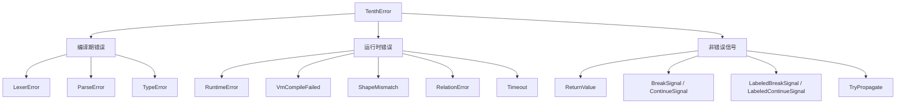

# Tenth 语言规范

> **版本**：v0.4.0 | **日期**：2026-08-03
> **定位**：Tenth 语言的**正式规范**（对外权威定义）。与《语言参考手册》互补——手册是**用法导向**（怎么用、API 怎么调），本规范是**定义导向**（是什么、语义规则是什么、边界在哪里）。
> **完整性承诺**：本规范每条规则都对应实现现状；对「远期 / 未实现」的语义（HKT、GAT、秩多态等）在第 7 章「演进与限制」如实标注，**不宣称未实现语义**。
> **测试锚点**：关键规则附守护测试名（`tenth/tests/*.rs`），读者可据此验证规则与实现的对应关系。

---

## 目录

- [第 1 章 总纲](#第-1-章-总纲)
- [第 2 章 词法规范](#第-2-章-词法规范)
- [第 3 章 类型系统（正式）](#第-3-章-类型系统正式)
- [第 4 章 所有权与借用（正式）](#第-4-章-所有权与借用正式)
- [第 5 章 表达式求值语义（正式）](#第-5-章-表达式求值语义正式)
- [第 6 章 错误模型（正式）](#第-6-章-错误模型正式)
- [第 7 章 演进与限制](#第-7-章-演进与限制)
- [附录 A 与《语言参考手册》交叉引用](#附录-a-与语言参考手册交叉引用)
- [附录 B 测试锚点索引](#附录-b-测试锚点索引)

---

# 第 1 章 总纲

## 1.1 语言定位

Tenth（**Ten**sor + **Z**en**th**）是一门 **AI 原生通用编程语言**：张量是内置类型、自动微分是一等公民，同时具备完整的通用编程能力（模块、trait、泛型、闭包、宏、错误处理）。

- **作为通用语言**：控制流、数据结构、模块系统、错误处理足以胜任日常编程任务；
- **作为 AI 语言**：张量内建、自动微分一等公民，训练循环无需外部框架；
- **差异化能力**：编译期 shape 检查等「护城河」特性（见 §1.3）把一类在主流框架中只能**运行时**暴露的错误提前到**编译期**。

## 1.2 设计原则

| 原则 | 含义 | 体现 |
|------|------|------|
| **张量一等公民** | 张量是内置类型，`a + b` 天然支持广播 | 手册 §11 |
| **自动微分一等公民** | 梯度是语言内在概念，`new_grad()` / `backward()` / `grad()` 内置 | 手册 §11.5 |
| **编译期安全优先** | 能在编译期判定的错误绝不留到运行时 | §3.3、§6 |
| **核心纯净** | autodiff、神经网络层通过标准库构建，编译器只理解张量原语 | 手册 §12 |
| **防误报是底线** | 编译期分析「宁可漏报、不可误报」；不 speculate | §3.3.5、§6.9 |
| **响亮报错优先** | 「静默错值」是最高危缺陷形态；不能确认正确的值必须报错或警告 | §6.7 |
| **检查多做、求解少做** | 静态分析在可判定子集内做深，超出可判定边界立即降级（回退/保守） | §3.3.5、§7.3 |

## 1.3 护城河特性（正式承诺）

Tenth 的差异化能力由以下「护城河」构成，均为**已实现**特性（覆盖范围与边界见对应章节）：

1. **编译期 shape 检查**：`Tensor` 的维度是类型的一部分；matmul 内侧维度、广播、构造 shape 等在编译期校验，不匹配即编译期报错（§3.3）。
2. **静默失败防护**：`Result`/`Option` 被静默丢弃 → 编译期警告；`?` / `or_die` / `assume_ok` 显式解包；`lossy` 污点格；字面量零除数编译期硬错误（§6.6、§6.7、§6.9）。
3. **类型状态（typestate）**：非法状态在编译期表达不出来（§3.14）。
4. **内存/算力预估**：≥1 GB 张量或 ≥1 GFLOP matmul 在编译期发出 warning（§3.3.6）。
5. **运行时自动微分 shape 校验**：`backward()` 梯度 shape 不匹配运行时报错（护城河 A，手册 §11.5）。
6. **关系调试器（FormalExplain）**：`backward` 失败时输出结构化根因分析（手册 §11.9）。

> 说明：typestate 的**当前落地范围**（状态参数 + impl 特化 + 方法过滤 + 调用点检查）见 §3.14；「完整 typestate 状态机验证」等属远期，见 §7.2。

## 1.4 版本与兼容性

- **当前版本**：v0.4.0（`tenth/Cargo.toml`）。
- **测试基线**：2048 passed / 0 failed / 15 ignored；62 个实例全部双路径（VM=JIT 与解释器）可运行；自举编译器（tenthc）验证 `[OK]`。
- **执行管线**：`.th → 词法 → 语法 → HIR → VM（默认）/ 解释器（`TENTH_NO_VM=1`）/ WASM / JIT`。
- **兼容性承诺**：本规范描述 v0.4.0 现状；语义变更必须同步更新本规范与《语言参考手册》。

## 1.5 术语与记号约定

- **编译期**：词法 / 语法 / 类型检查 / 静态分析阶段。
- **运行时**：程序执行阶段（VM / 解释器 / JIT / WASM 四路径，语义应当一致；不一致处如实标注）。
- **$T \simeq U$**：类型等价（§3.12）。
- **$\mathcal{D}$**：单维抽象域 $\{\text{Any}\} \cup \{\text{Known}(n)\} \cup \{\text{Symbol}(s)\}$（§3.3.2）。
- **$m(\cdot,\cdot)$**：维度合并运算（§3.3.3）。
- 代码块中的 `//` 为 Tenth 源码注释。

---

# 第 2 章 词法规范

> 对应实现：`tenth/src/lexer/`；测试锚点：`lexer_test.rs`、`int_types_test.rs`、`string_encoding_test.rs`。

## 2.1 字符集与源码编码

- 源码为 **UTF-8** 文本；开头的 BOM（U+FEFF）自动剥离。
- 行终止符为 `\n`（`\r\n` 中的 `\r` 按普通字符处理，注释/字符串外不特殊化）。
- 标识符允许 Unicode（源码层按字符流处理，保留字为 ASCII 序列）。

## 2.2 注释

```tenth
// 行注释：到行尾结束
/* 块注释：支持嵌套 */
```

块注释可嵌套（`/* /* */ */` 合法）；注释不产生 token。

## 2.3 Token 集合（正式表）

词法器将源码规约为如下 token 流（`TokenKind`，`tenth/src/lexer/token.rs`）：

| 类别 | Token | 说明 |
|------|-------|------|
| 字面量 | `IntLiteral(i64, dtype)` | 整数，携带 dtype（§2.6.1） |
| 字面量 | `FloatLiteral(f64, dtype)` | 浮点，携带 dtype（§2.6.2） |
| 字面量 | `StringLiteral(String)` | 普通字符串 |
| 字面量 | `ByteString(Vec<u8>)` | 字节串 `b"..."` |
| 字面量 | `RawString(String)` | 原始字符串 `r"..."` |
| 字面量 | `MultiLineString(String)` | 多行字符串 `"""..."""` |
| 字面量 | `InterpolatedString(Vec<StringPart>)` | 插值字符串 `"{id}"` |
| 字面量 | `FString(Vec<StringPart>)` | 模板字符串 `f"..."` |
| 字面量 | `CharLiteral(char)` | 字符 `'a'` |
| 名字 | `Identifier(String)` / `Lifetime(String)` | 标识符 / `'a` 生命周期标签 |
| 关键字 | 见 §2.4 | |
| 自定义运算符 | `CustomOperator(String)` | `@`/`$`/`~` 的连续组合（§2.8） |
| 运算符 | `+ - * / % == != < > <= >= && \|\| ! & \| ^ << >> = += -= *= /=` | 见 §2.7（`&` 用于引用、`\|` 用于闭包、`^`/`<<`/`>>` 无二元用途） |
| 定界符 | `( ) [ ] { } , ; : . .. ..= ... -> => :: ? #` | |
| 特殊 | `Eof` | 输入结束 |

每个 token 携带 `Span { line, col }`（1 起始），供错误定位（§6.8）。

## 2.4 关键字（保留字）

以下标识符是**保留字**，不可用作变量/函数/类型名（语法解析时按关键字处理）：

```
fn    let    mut    if     else   match   for    while   loop
do    break  continue  return  try   use    mod    pub    trait
impl  enum   struct  union  type  self   async  await  spawn
task  shard  node   macro  where  as    in     dyn    move
lossy operator true   false  yield
```

状态说明（诚实标注）：

- **活跃关键字**：`fn let mut if else match for while loop do break continue return try use mod pub trait impl enum struct union type self async await spawn macro where as in true false move dyn lossy operator yield` 均参与语法；
- **预留未启用**：`task` / `shard` / `node` 被词法器保留，但语法层尚未启用（`task` 预留为 `Task<T>` 类型名与未来任务语法的候选；`shard`/`node` 为远期分布式计算预留）。

> ~~现状提示~~：`yield` 为活跃关键字（`yield` / `yield expr`，§5.14）；《语言参考手册》§2.2 关键字表已于 2026-08-03 补齐 `yield`。

## 2.5 标识符与名字

- **标识符**：由字母 / 数字 / 下划线组成，不以数字开头；可用于变量、函数、类型、模块、trait、enum 变体名。
- **生命周期标签**：`'` 后跟标识符（如 `'a`），词法上为 `Lifetime` token；在语句起始且后随循环关键字时是**循环标签**（`'outer: while ...`），在类型注解中是可选的显式生命周期标注（§3.6）。
- **自定义运算符名**：`@` / `$` / `~` 三个字符的连续组合（§2.8）。

## 2.6 字面量

### 2.6.1 整数字面量

```
42          十进制（默认 dtype 为 i32）
0x2A        十六进制（0x / 0X）
0b101010    二进制（0b / 0B）
0o52        八进制（0o / 0O）
1_000_000   下划线分隔（任何进制均支持）
42u8  42i64 类型后缀
```

规则：

1. 无后缀字面量默认 dtype 为 **i32**；
2. **无后缀且超出 i32 范围**（$< -2^{31}$ 或 $> 2^{31}-1$）时**自动提升为 i64**（不报错）；
3. 带后缀的字面量必须落在该 dtype 范围内，否则编译期 `LexerError`（如 `256u8` 报错）；
4. 后缀集合：`i8 i16 i32 i64 u8 u16 u32 u64`。

> 测试锚点：`int_types_test.rs`（14 项：dtype 四层同步 + 后缀 + 范围检查 + 提升）。

### 2.6.2 浮点字面量

```
3.14        十进制（默认 dtype 为 f64）
1e3  1.5e-2  科学计数法
3.14f32     显式 f32
3.14f64     显式 f64
```

规则：

1. 无后缀默认 **f64**；`f32` / `f64` 后缀显式指定 dtype；
2. 类型推断遵循提升规则：`f32 + f32 → f32`，`f32 + f64 → f64`（隐式提升为 f64）。

### 2.6.3 布尔字面量

```
true   false
```

dtype 为 `bool`。

### 2.6.4 字符字面量

```
'a'   '好'   '\n'   '\u{1F600}'
```

- 单引号包裹的单个 Unicode 字符，dtype 为 `char`；
- 支持字符串相同的转义序列（§2.6.5）。

> 测试锚点：`char_test.rs`（全链路：lexer → parser → HIR → VM/解释器/JIT）。

### 2.6.5 字符串字面量与转义

```
"hello"
"line 1\nline 2"
"caf\u{00E9}"          // é（Unicode 码点转义）
"\x48\x69"             // "Hi"（十六进制字节转义）
```

转义序列（全部已实现）：

| 转义 | 含义 |
|------|------|
| `\n` `\r` `\t` | 换行 / 回车 / 制表 |
| `\\` `\"` | 反斜杠 / 双引号 |
| `\{` `\}` | 字面花括号（插值语境下转义） |
| `\0` | NUL 字符 |
| `\u{HEX}` | Unicode 码点（十六进制），按 UTF-8 编码输出；非法码点（如 `\u{110000}`）→ 词法错误 |
| `\xNN` | 十六进制字节转义 → 对应字符；不足两位十六进制 → 词法错误 |
| 其他 `\c` | **向后兼容**：原样保留字符 `c`（不报错） |

> 测试锚点：`string_encoding_test.rs`（`\u{...}` 与 `\xNN` 转义，AUDIT-11.4.25）。

### 2.6.6 原始字符串 `r"..."`

```
r"C:\path\no\escape"     // 反斜杠不转义，原样保留
```

- `r` 前缀；内容**不做任何转义**（`\n` 保持两个字符 `\`、`n`）；
- 适用于正则、路径等含大量反斜杠的文本。

### 2.6.7 多行字符串 `"""..."""`

```
"""
第一行
第二行
"""
```

- 三引号闭合；内容保留换行与缩进；不做转义处理。

### 2.6.8 字节串 `b"..."`

```
b"\x00\x01\x02"          // Vec<u8>：[0, 1, 2]
b"abc"
```

- 仅允许 ASCII 字符 + `\xNN` 转义（每字节 ∈ [0, 255]）；
- 类型为字节数组（运行时 `Vec<u8>`）；非法转义 → 词法错误。

### 2.6.9 插值字符串 `"{identifier}"`（词法层）

```
let name = "Alice";
let s = "hello {name}";    // 词法层：{name} 被识别为插值，编译为字符串拼接
```

- 无 `f` 前缀的字符串中，`{identifier}` 被词法器识别为 `InterpolatedString`；
- **仅支持简单标识符替换**（`{name}`），编译为字符串拼接；
- 与模板字符串 `f"..."` 的区别见 §2.6.10。

### 2.6.10 模板字符串 `f"..."`（编译为 `format()`）

```
let name = "Alice";
let age = 30;
let s = f"name={name}, age={age}";        // 等价于 format(...)
let t = f"pi ≈ {3.14159:.2f}";            // 支持格式说明符
let brace = f"{{ literal }}";             // {{ → 字面 '{'
```

- `f` 前缀；`{expr}` 内为**任意表达式**（可嵌套花括号），`{expr:spec}` 支持格式说明符；
- 编译期等价转换为 `format()` 调用（§12.15 手册），占位符按 `args` 顺序绑定；
- `{{` / `}}` 转义为字面花括号；
- 词法/语法错误（如未闭合 `{`）在编译期报错，携带 f-string 所在行列。

### 2.6.11 张量字面量

```
tensor[[1.0, 2.0], [3.0, 4.0]]     // 二维 f64 张量
```

- `tensor[[...]]`：嵌套数组字面量，默认 dtype f64；
- shape 由嵌套深度与各层长度推导，编译期参与 shape 检查（§3.3）。

## 2.7 运算符与优先级（正式表）

运算符优先级（从高到低；数值取自实现 `parser/expr.rs::binop_precedence`）：

| 级别 | 运算符 | 结合性 | 说明 |
|------|--------|--------|------|
| （最高） | `.` `::` `[]` `()` | — | 方法调用 / 字段访问 / 命名空间 / 索引 / 调用（后缀） |
| 1 | 一元 `-` `!` `*` `&` `&mut` | — | 取负 / 逻辑非 / 解引用 / 引用 / 可变引用 |
| 2 | `*` `/` `%` | 左 | 乘除模 |
| 3 | `+` `-` | 左 | 加减 |
| 3 | **自定义运算符**（`@` `$` `~` 组合） | 左 | 统一默认与 `+`/`-` 同级（§2.8） |
| 4 | `<` `>` `<=` `>=` | 左 | 关系比较 |
| 5 | `==` `!=` | 左 | 相等比较 |
| 6 | `&&` | 左 | 逻辑与（短路） |
| 7 | `\|\|` | 左 | 逻辑或（短路） |
| 8 | `=` `+=` `-=` `*=` `/=` | 右 | 赋值 |
| 9 | `..` `..=` | 左 | 范围（最低，`parse_binary` 特判） |

**形式化**：设 $\text{prec}(\text{op})$ 为上表级别，则 `a op b` 归约仅当 $\text{prec}(\text{op}) \ge \text{prec}(\text{当前上下文})$；同级别左结合。例：

$$a + b * c \equiv a + (b * c), \qquad a == b < c \equiv a == (b < c)$$

**重要说明**：

1. **关系比较（`< > <= >=`）绑定比相等（`== !=`）更紧**：`a == b < c` 解析为 `a == (b < c)`。实现现状（`binop_precedence`：Lt/Gt/LtEq/GtEq=3，EqEq/NotEq=2）；《语言参考手册》§5.12 已于 2026-08-03 按实现修正（比较分组列级）。
2. 词法存在的 `&` `|` `^` `<<` `>>` token 中：`&`/`&mut` 用于引用（§4.4）；`|x|` 用于闭包；`>>` 在泛型嵌套 `Wrap<Vec<i64>>` 中由 `>` 处理（§3.10）；`^`、`<<`、`>>` 作为**位运算符未实现**（`token_to_binop` 不含它们）。
3. 赋值优先级低于比较，因此 `x = a == b` 合法（先算 `a == b` 再赋值）。
4. `?`（QuestionMark）为**后缀一元**运算符（§5.15），在 `parse_unary` 层处理。

> 测试锚点：`operator_precedence_test.rs`（注：该锚点文件当前未建，优先级语义由实现 `binop_precedence` + 手册 §5.12 守护）；手册 §5.12 与实现已一致（2026-08-03 修订）。

## 2.8 自定义运算符（`@` / `$` / `~`）

用户可声明**新的二元运算符**并绑定到函数（M3.1，最小可行版本）：

```tenth
operator @@ = fn(a: i64, b: i64) -> i64 { a + b }   // 声明
{ 1 @@ 2 }                                          // 使用 → 3
```

规则：

1. **字符集**：`@` / `$` / `~` 三个字符的连续组合（`@@`、`@~`、`$@$` …）；这三个字符词法上原本无用途，与全部内置 token 零冲突。**不开放**含内置运算符字符（`<`、`>`、`|` 等）的组合（如 `<|>`）。
2. **优先级**：所有自定义运算符统一默认优先级 4（与 `+`/`-` 同级，左结合）；当前不提供 per-operator 优先级声明。
3. **降级**：`a <op> b` 编译期降级为对绑定函数的调用（合成名 `__custom_op_<op>` 注册为普通函数），VM / 解释器 / WASM 天然支持。
4. **错误**：未声明即使用 → 编译期 `TypeError`「未声明的运算符」；重复声明 → 编译期 `TypeError`「重复声明」。
5. **共存**：与内置运算符重载（`impl Add for T` 等）可共存。
6. **注意**：`@` 单字符本身**没有**内置 matmul 绑定（手册「语言定位」中的 `Tensor @ Tensor` 是说明性伪语法；实际 matmul 为 `.matmul()` 方法）。

> 测试锚点：`custom_operator_test.rs`（15 项）、`tenthc_custom_operator_test.rs`。

## 2.9 词法错误

词法阶段错误统一为 `LexerError`，格式：`第 {line} 行第 {col} 列：词法错误 — {message}`（§6.2）。典型触发：非法转义、非法数字后缀范围、未闭合字符串、`\u{...}` 非法码点等。

---

# 第 3 章 类型系统（正式）

> 对应实现：`tenth/src/hir/types.rs`；测试锚点：`type_inference_test.rs`、`shape_check_compile_test.rs`、`cross_fn_shape_test.rs`、`forward_ref_shape_test.rs`、`generic_enum_test.rs`、`typestate_test.rs`、`dyn_trait_test.rs`、`newtype_test.rs`。

## 3.1 类型层级总览

```mermaid
graph TD
    T[Type] --> Scalar[标量 BaseType]
    T --> Tensor[Tensor[dtype, dims]]
    T --> Container[容器]
    T --> Nominal[名义类型]
    T --> RefT[引用]
    T --> FnT[函数/闭包]
    T --> DynT[dyn Trait]
    T --> Smart[智能指针]
    T --> Special[特殊类型]

    Scalar --> Int[i8 i16 i32 i64 u8 u16 u32 u64]
    Scalar --> Float[f16 f32 f64 bf16]
    Scalar --> Other[bool char str Unit BigInt C64 C128 Decimal]
    Container --> VecT[Vec<T>]
    Container --> Map[HashMap<K,V>]
    Container --> Str[String]
    Container --> Arr[[T; n]]
    Container --> Tup[Tuple (A, B)]
    Container --> Rng[Range]
    Nominal --> Struct[struct / Newtype]
    Nominal --> Enum[enum]
    Nominal --> Union[union]
    RefT --> Ref[&T]
    RefT --> MutRef[&mut T]
    Smart --> SmartT[Box Rc Arc Pin Weak]
    Special --> Never[Never !]
    Special --> Future[Future<T>]
    Special --> TypeParam[TypeParam T]
    Special --> Unknown[Unknown]
    Special --> Generic[Generic { base, args }]
```

## 3.2 标量类型（`BaseType`）

| 类别 | 类型 | 说明 |
|------|------|------|
| 有符号整数 | `i8` `i16` `i32` `i64` | dtype 全程保留（词法→AST→HIR→Value 四层） |
| 无符号整数 | `u8` `u16` `u32` `u64` | |
| 浮点 | `f16` `f32` `f64` `bf16` | IEEE 浮点；f32/f64 为张量元素类型（f16/bf16 支持见手册 §11.11） |
| 布尔 | `bool` | |
| 字符 | `char` | Unicode 标量值 |
| 字符串 | `str` | 不可变 UTF-8 字符串 |
| 单元 | `()` | 空值；空元组编译为 `Value::Unit` |
| 特殊数值 | `BigInt` `C64` `C128` `Decimal` | 词法/类型层存在（算力预估用），运行时支持有限 |

**dtype 语义**：

- 整数字面量默认 i32，超范围自动提升 i64（§2.6.1）；后缀字面量越界 → 词法错误。
- 算术溢出：运行时 `checked_*` 检测，i64 层溢出与窄 dtype 范围溢出统一转干净 `RuntimeError`（VM / JIT / 解释器三路径一致）。测试锚点：`jit_int_overflow_test.rs`、`int_types_test.rs`。
- 浮点提升：`f32 + f64 → f64`（隐式提升）；`f32 + f32 → f32`。
- `str` 字段在 Copy 判定中视为 Copy（深拷贝安全，设计取舍，§4.3）。

## 3.3 张量类型 `Tensor[dtype, dims]`

张量的 **shape 是类型的一部分**：

$$T = \text{Tensor}[\tau,\ d_1,\ d_2,\ \dots,\ d_k], \qquad \tau \in \{\text{f32},\ \text{f64}\} \text{（当前元素类型）}$$

### 3.3.1 维度抽象域（正式定义）

单维抽象域（对应实现 `Dim`，`hir/types.rs`）：

$$\mathcal{D} = \{\text{Any}\} \cup \{\text{Known}(n) : n \in \mathbb{Z}\} \cup \{\text{Symbol}(s) : s \in \text{Str}\}$$

- $\text{Known}(n)$：编译期已知的具体维度（字面量 shape、构造 shape 推断）；
- $\text{Symbol}(s)$：符号维度（大写标识符或变量实参），跨调用做约束传播；
- $\text{Any}$：未知维度（不约束；`..` 通配）。

语法：

```tenth
Tensor[f64, 3, 224, 224]     // Known：3×224×224
Tensor[f32, M, K]            // Symbol：符号维度
Tensor[f64, ..]              // Any：该维不约束（注解可解析；秩多态见 §7.2）
```

### 3.3.2 维度合并运算（正式定义）

多返回值 / 多分支的 shape 合并逐维进行。合并运算 $m: \mathcal{D} \times \mathcal{D} \to \mathcal{D}$：

$$m(x, y) = \begin{cases} x & x = y \\ y & x = \text{Any} \\ x & y = \text{Any} \\ \text{Any} & \text{otherwise}\end{cases}$$

- $m$ 满足交换律、幂等律，但**不满足结合律**（数理部论证，见 `docs/shape-check-roadmap/前向引用断点收敛性论证.md` 引理 1）——因此实现采用 **n 元共识语义**：同一多重集内所有非 Any 输入相同时取该值，否则取 Any（消除折叠顺序依赖）。
- 语义本质：「共识合并」——所有非 Any 分支一致才保留，否则坍缩为 Any（最不精确）。

### 3.3.3 类型等价（张量）

两个张量类型等价当且仅当 dtype 相同且逐维满足：

| $d_1$ \ $d_2$ | Known(a) | Symbol(s) | Any |
|---------------|----------|-----------|-----|
| **Known(a)** | $a = b$ | 兼容（约束传播） | 兼容 |
| **Symbol(s)** | 兼容 | 同名兼容 | 兼容 |
| **Any** | 兼容 | 兼容 | 兼容 |

- **已知维度**：必须逐位相等，否则编译期 `TypeError`（如 `[3,4] @ [5,6]` 内侧 $4 \ne 5$）；
- **符号维度同名等价**：matmul 内侧 `Symbol(K)` 与 `Symbol(K)` 兼容，不同名报错；
- **跨函数 unify**：调用点把实参代换进被调函数返回 shape——字面量 → `Known`，变量 → `Symbol`（保守），其他表达式 → `Any`（保守，防误报）；只代换形参名对应的 Symbol。

### 3.3.4 张量运算 shape 规则（编译期检查）

已实现编译期 shape 规则的算子/操作（能力全梳理 Phase 1–4）：

| 操作 | shape 规则 | 检查时机 |
|------|-----------|----------|
| matmul | $(M,K) @ (K,N) \to (M,N)$；3D batched $(B,M,K) @ (B,K,N) \to (B,M,N)$ | 编译期 TypeError |
| 元素级二元（+ - * /） | 两侧可广播（含标量广播） | 编译期 TypeError |
| sum / mean | axis 降维 | 编译期 |
| reshape | 目标元素总数须与源一致（字面量推断） | 编译期 |
| permute / broadcast_to / cat / argmax / gelu / masked_fill | 各自 shape 变换 | 编译期 |
| 构造（zeros/ones/rand/randn/tensor 字面量） | 字面量 shape 推断；变量实参 → Symbol | 编译期 |
| cross_entropy / reshape 反向 | 梯度 shape 检查（护城河 A 深化） | 编译期 + 运行时 |

**跨函数 shape 组合**（Phase 4 + 函子化重构 + 前向引用断点 4.2）：

- 函数体的精确 shape 传播到调用方（`fn make() -> Tensor[f64, ..] { zeros(3,4) }` → 调用方拿 `[3,4]`）；
- 多 return 路径 n 元共识合并（§3.3.2）；维度数不同 → 报错；递归函数跳过（用注解签名）；
- **前向引用断点 4.2**（2026-08-03 落地）：`lower_program` 尾部做**无环全量不动点**（`run_forward_ref_shape_fixpoint`，$2n+1$ 轮上限兜底），使「main 先于 make 定义」也拿到 body 精化 shape（顺序无关）；`main` 先于 `make` 且 shape 冲突 → 编译期拦截。
  - 测试锚点：`forward_ref_shape_test`（26 项）、`cross_fn_shape_test`（21 项）、`shape_check_compile_test`（83 项）。

### 3.3.5 shape 检查覆盖边界（诚实标注）

| 边界 | 状态 |
|------|------|
| 递归程序的 shape 精化（SCC 感知） | ❌ 未实现（后续候选：递归程序 shape 精化） |
| 参数 shape 一致化（战略方向 B：shape 代数求解器） | ❌ 未实现（规划中，见 `docs/shape-check-roadmap/战略规划.md` 方向 B） |
| 符号维度跨函数 unify 求解 | ⚠️ 部分（同名等价 + 实参代换已实现；完整约束求解未实现） |
| 秩多态（`..` 任意秩的一等特性） | ❌ 未实现（M3.2 决策：归护城河路线图；注解 `Tensor[f64, ..]` 可解析） |
| 防误报策略 | 宁可漏报不可误报；不 speculate（shape 已知但值未知不推断） |

### 3.3.6 编译期内存 / 算力预估（护城河 D）

- 编译期计算 `static_numel` / `static_bytes`；≥ 1 GB 张量或 ≥ 1 GFLOP matmul → `TenthWarning`（非致命）；
- 插入点：构造函数 / 函数调用 / 方法调用；`param(t)` ≥ 1 GB 时发梯度 OOM warning；
- 测试锚点：`memory_estimate_test.rs`（35 项，32 passed + 3 ignored）。

## 3.4 容器类型

| 类型 | 语法 | 说明 |
|------|------|------|
| 动态数组 | `Vec<T>` | 可变长度；`.push` / `.get` / `.set` 等（手册 §12.1） |
| 哈希表 | `HashMap<K, V>` | `.insert` / `.get` / `entries` 等（手册 §12.2） |
| 字符串 | `String` / `str` | `str` 为字面量类型；`String` 为可变构造（手册 §12.3） |
| 定长数组 | `[T; n]` | 元素类型 + 可选长度 |
| 元组 | `(A, B, C)` | 异构定长；`let (a, b) = pair` 解构；空元组 `()` 即 Unit |
| 范围 | `Range` | 一等类型（`1..10` / `1..=10`），可作参数/返回类型、存变量 |

> 测试锚点：`tuple_test.rs`；Range 见 `range_test.rs`。

## 3.5 名义类型：结构体 / Newtype / 枚举 / Union

### 3.5.1 结构体

```tenth
struct Point { x: f64, y: f64 }
let p = Point { x: 3.0, y: 4.0 };
p.x                      // 字段访问
let cfg = Config { lr: 0.001, .. };   // 其余字段取默认值（0 / false / ""）
```

- 支持默认字段语法 `..`；
- 结构体是**名义类型**：与字段相同的裸类型不兼容（§3.12）。

### 3.5.2 元组结构体 / Newtype

```tenth
struct Meters(f64)
struct Pair(i64, str)
let m = Meters(3.5);
m._0                     // 字段访问用 ._0（不支持 .0）
```

- 构造：位置实参；字段访问 `._0`、`._1`、…；
- `Meters` 与裸 `f64` 是**不同名义类型**，互不兼容；两个同裸类型的 Newtype 也互不兼容（单位/语义区分）；
- 测试锚点：`newtype_test.rs`（12 项）。

### 3.5.3 枚举（代数数据类型）

三种变体：单元（`None`）、元组（`IntLiteral(i64)`）、记录（`Some(value: i64)`）。支持泛型参数 `<T>`（§3.10）：

```tenth
enum Maybe<T> { Just(T), Nothing }
let mb = Maybe<i64>::Just(42);   // 显式类型实参
let ms = Maybe::Just("hi");      // 推断构造
match mb { Maybe::Just(x) => x, Maybe::Nothing => -1 }
```

- match 解构绑定变量类型为**实例化后的具体类型**；
- 穷尽性检查：无通配符且未覆盖全变体 → 编译期 `TypeError`；
- 测试锚点：`generic_enum_test.rs`、`pattern_match_test.rs`。

### 3.5.4 Union（带活跃字段的 tagged union）

```tenth
union Number { integer: i64, float: f64 }
let n1 = Number { integer: 42 };   // 恰好激活一个字段
n1.integer                          // 仅活跃字段可访问
```

- **非** C 风格内存重叠：同一时刻恰好一个字段激活（运行时 `Value::Union{name, active_field, value}`）；
- 仅活跃字段可访问/修改；访问非活跃字段 → 错误；多字段构造 / 未知字段 / `..` 默认填充 → 编译期 `TypeError`；
- 与枚举分工：union 是开放字段容器（直接字段访问），枚举是封闭变体（match 穷尽）；
- 测试锚点：`union_test.rs`（25 项）。

## 3.6 引用类型 `&T` / `&mut T`

```tenth
let r = &x;        // 不可变引用（共享借用）
let m = &mut y;    // 可变引用（独占借用）
*r  *m             // 解引用
```

- `&'a T` 显式生命周期标注可解析并透传（`Type::Ref/MutRef` 第二参数），但**不参与借用检查语义**（借用检查是语句粒度保守近似，§4.5）——此为设计取舍；
- 借用规则见 §4.4。

## 3.7 函数类型与闭包

- 函数类型 `fn(params) -> Ret`（`Type::FnType`）；
- 闭包 `|x, y| expr` 自动捕获外层变量（§5.10）；闭包值可作参数/返回值（高阶函数）、可存储；
- 函数签名必须显式标注参数与返回类型；局部变量完全推断（§3.11）；
- 测试锚点：`closure_test.rs`、`letrec_test.rs`、`curry_test.rs`。

## 3.8 `dyn Trait` 动态分发对象

```tenth
let dc: dyn Draw = c;    // 类型注解驱动升级：具体类型 → trait 对象
dc.name()                // 按具体类型动态分派
```

- **升级**：类型注解驱动（`into_dyn` native 改写）；未实现该 trait 的类型升级 → 编译期 `TypeError`；
- **分派**：调用时按对象的 `(trait_name, type_name)` 查 trait impl 表（运行时按类型分派，复用 `trait_impls`，非真 vtable）；
- 已知边界：trait 默认方法体不注册 `__dyn_*`（dyn 上调默认方法报错）；dyn 不可 Copy、不自动 drop；
- 测试锚点：`dyn_trait_test.rs`（10 项）。

## 3.9 智能指针类型

| 类型 | 运行时表示 | 语义 |
|------|-----------|------|
| `Box<T>` | `Value::HeapBox` | 堆分配独占所有权 |
| `Rc<T>` | `Value::SharedBox(Rc<RefCell<Value>>)` | 引用计数共享；`clone()` 只增计数 |
| `Arc<T>` | 同 `Rc`（等价实现） | 原子引用计数（当前与 Rc 等价） |
| `Pin<T>` | `Value::Pin` | 固定不可移动包装 |
| `Weak<T>` | `Value::Weak(Weak<RefCell<Value>>)` | 弱引用，不增计数；`weak_upgrade` 尝试取强引用 |

- 取值：`.deref()`；共享：`Rc::clone()`；弱引用升级：`weak_upgrade(w) -> Option<Rc<T>>`；
- `Weak::new(rc)` 接受 `Rc`/`Arc` 值，非 Rc 值 → 运行时错误；悬垂 Weak 的 `type_of` → Unknown、Display → `Weak<dangling>`；
- 测试锚点：`smart_ptr_test.rs`（28 项）、`weak_test.rs`（20+ 项，含函数边界释放）。

## 3.10 泛型与实例化规则

### 3.10.1 泛型函数 / 结构体 / 枚举

```tenth
fn identity<T>(x: T) -> T { x }
struct Pair<T, U> { first: T, second: U }
enum Maybe<T> { Just(T), Nothing }
```

规则：

1. **显式类型实参**：`identity<i64>(42)`、`Pair<i64, f64> { ... }`、`Maybe<i64>::Just(42)`；
2. **推断构造**：`Maybe::Just(42)` 从变体字段类型推断（`Vec<T>`/`Option<T>`/`[T]`/`&T` 嵌套位置提取）；
3. **带 trait 约束与无约束的泛型函数调用均需显式类型实参**（不支持隐式推断，如 `sum<i64>(3,4)`）；
4. **where 子句**：`fn sum<T: Add>(a: T, b: T) -> T` 支持 trait 约束；
5. **嵌套泛型**：`Wrap<Vec<i64>>`（`>>` 作为 Shr 处理）；
6. **Phantom 类型参数**：未使用的类型参数天然可用（无报错/警告），常与 typestate 协同（§3.14）；测试锚点：`phantom_type_test.rs`；
7. **泛型函数体内实例化**：`tensor<f64>([...])`、`randn<T>`/`zeros<T>`/`ones<T>`/`rand<T>` 在泛型体内按 `(name, dtype)` 改写为 `*_f32`/`*_f64` 变体（`NATIVE_GENERIC_CTORS`）；
8. **泛型 trait/inherent 方法**：泛型模板 body 在实例化点改写（inherent `__{Type}_{method}` 优先、trait `__dyn_*` 恰一命中其次），VM 与解释器一致；测试锚点：`generic_trait_dispatch_test`（9 项）。

### 3.10.2 实例化时机

- 泛型在**调用点/构造点实例化**（monomorphization 式），实例化后的类型参与类型检查与 shape 检查；
- 泛型实参替换在 HIR lower 后、调用前完成（`substitute_kind_in_place`）。

## 3.11 类型推断

| 位置 | 推断规则 |
|------|----------|
| 函数签名 | **必须显式标注**参数与返回类型 |
| 局部变量 | 完全推断（`let x = expr`） |
| 泛型实参 | 调用处显式指定（或从变体字段/实参推断，见 §3.10） |
| `Result`/`Option` 解包 | `or_die`/`assume_ok` 返回第一个泛型参数 `T`；泛型信息缺失时保守为 Unknown（运行时仍正确解包） |
| `?` | 从 `Result<T>` 提取 `T` |

## 3.12 类型等价与名义类型

- **名义类型**：struct / Newtype / enum / union 均按名字等价（不同名即不同类型）；`Meters` ≠ `f64`，`File<Open>` ≠ `File<Closed>`；
- **泛型等价**：`Generic { base, args }` 按 base 名 + 全部实参逐位等价；
- **数值兼容**：调用点参数类型检查中，数值类型（i32/i64/f32/f64、整数↔浮点）按运行时值语义互相兼容放行（防误报）；其余类型不兼容 → 编译期 `TypeError`（带行/列）；
- **Never**：可以统一到任何类型 $T$（unify 结果为 $T$）；
- **Unknown / TypeParam**：保守放行（防误报）；
- **协变/逆变**：❌ 未实现（M4 决策，远期研究，§7.2）；
- 测试锚点：`call_arg_type_check_test`（24 项，typestate G6 调用点检查）。

## 3.13 特殊类型

| 类型 | 语义 |
|------|------|
| `Never`（`!`） | 发散类型：永不返回的表达式/函数（`exit()`、无限循环）；可 unify 到任何类型；函数体全分支 Never → 函数返回 Never |
| `Future<T>` | 异步值：`async fn` 返回；`await` 解包（§5.13） |
| `Unknown` | 泛型信息缺失时的保守类型（运行时行为正确） |
| `TypeParam` | 泛型形参占位 |
| `Range` | 一等范围类型（§3.4） |

## 3.14 类型状态（typestate）—— 状态参数即类型

> 核心命题：**非法状态表达不出来**。当前落地范围（G1–G6 已实现部分）：

```tenth
enum Open {}
enum Closed {}
struct File<S> { path: str }

impl File<Open>   { fn read(self) -> str { self.path }
                    fn close(self) -> File<Closed> { ... } }
impl File<Closed> { fn reopen(self) -> File<Open> { ... } }
```

规则：

1. **状态用空 enum 表示**（编译期类型标注，运行期不产生值）；**泛型 struct 携带状态参数**（未使用类型参数 = Phantom，§3.10）；
2. **impl 按状态实参特化**：`impl File<Open>` 与 `impl File<Closed>` 方法互不覆盖（mangled `__File_Open_read`）；裸 `impl File` 作为通用回退；
3. **方法解析按 receiver 静态状态过滤**：非法状态方法调用 → 编译期 `TypeError`（`类型 'File<Closed>' 没有方法 'read'`）；
4. **状态转换方法消费 receiver**（`close` 后旧变量标记已移动）；状态不变方法不消费；
5. **调用点参数类型检查**（G6）：`File<Closed>` 实参传 `File<Open>` 形参 → 编译期 `TypeError`；
6. 字面量构造携带状态实参：`File<Open> { path: "a.txt" }`。

- 测试锚点：`typestate_test`（15 项）、`typestate_selfhost_test`、`call_arg_type_check_test`（24 项）、`phantom_type_test.rs`；
- 完整 typestate（状态转换声明的编译期状态机验证等）见 §7.2。

## 3.15 未实现 / 远期类型特性（如实标注）

| 特性 | 状态 | 出处 |
|------|------|------|
| 高阶类型 HKT（`Functor<F>`） | ❌ 未实现 | M4 决策：远期研究 |
| GAT（泛型关联类型） | ❌ 未实现 | M4 决策：远期研究 |
| Const 泛型 | ❌ 未实现 | M4 决策：归 shape 检查护城河路线 |
| 协变 / 逆变 | ❌ 未实现 | M4 决策：远期研究 |
| 秩多态（`Tensor[f64, ..]` 一等特性） | ❌ 未实现（注解可解析） | M3.2 决策：归护城河路线 |
| 生命周期省略 | ❌ 未实现 | M4 决策：无显式 lifetime 语义检查 |
| 过程宏 / 语法扩展插件 | ❌ 未实现 | M4 决策：需编译插件机制 |

---

# 第 4 章 所有权与借用（正式）

> 对应实现：`tenth/src/hir/lower/`（scope.rs / lower_stmt.rs / lower_expr.rs）；测试锚点：`move_semantics_test.rs`、`borrow_test.rs`、`drop_test.rs`、`copy_trait_test.rs`、`smart_ptr_test.rs`、`weak_test.rs`、`toplevel_let_test.rs`。

## 4.1 let 绑定与不可变性

```tenth
let x = 42;        // 不可变绑定
let mut y = 0;     // 可变绑定
y = y + 1;         // 仅可变绑定可赋值
```

- 绑定默认不可变；`mut` 声明可变；
- **遮蔽**：`let x = x + 1` 创建新绑定遮蔽旧绑定（非原地修改）；
- **无 init 绑定**（M1-S4b-2 明确语义）：
  - `let x: T;`（带注解、无 init，函数内）→ 类型零值默认（`str`→`""`、`i64`→0、`f64`→0.0、`bool`→false；VM + 解释器双侧，WASM 一致）；
  - `let x;`（无注解、无 init）→ 编译期 `TypeError`；
  - 顶层（全局）无 init（含带注解）→ 编译期 `TypeError`「全局必须带初始值」。

## 4.2 移动语义（`move`）

```tenth
let y = move x;    // 所有权转移给 y，此后 x 不可用
```

规则：

1. `move` 显式转移所有权；被 move 后的变量再使用 → 编译期「使用了已移动的值」；
2. `move x` 对 Copy 类型解包为值拷贝（原变量仍可用）；
3. 赋值 `let q = p`：Copy 类型为**隐式克隆**（不移动）；非 Copy 类型为移动语义（§4.3）；
4. `move` 后变量不再触发 drop（防双重释放）。

## 4.3 Copy 语义与自动派生

- **自动派生**：全字段均为 Copy 类型（基础标量等）的 struct 自动 Copy；含非 Copy 字段（如 `Vec`）则走移动语义；
- **显式 `impl Copy`** 生效（与自动派生等价判定）；
- **Copy 与 Drop 互斥**：实现 `Drop` 的类型不能同时是 Copy（析构与复制语义冲突）；
- `str` 字段视为 Copy（深拷贝安全，设计取舍）；
- 测试锚点：`copy_trait_test.rs`（9 项）。

## 4.4 引用与借用规则

```tenth
let r = &x;         // 不可变引用（共享借用）
let m = &mut y;     // 可变引用（独占借用）
r.x = 3.0;          // 通过 &mut 修改字段（字段赋值）
```

规则（编译期检查）：

1. **多个 `&` 共享引用可共存**；
2. **`&mut` 与其他引用互斥**；
3. 被 `move` 后的变量不可再使用；
4. 违反规则 → 编译期报错。

## 4.5 借用检查（语句粒度保守近似）

- 实现为**语句粒度的保守近似**（T19 论文）：在语句边界 `release_borrows`，不做完整生命周期分析；显式 `&'a T` 标注不参与借用检查（设计取舍，与 GC/goto 同列）；
- **已知边界（如实）**：AUDIT-11.1（T19 定理 B6）披露的 unsoundness——跨语句的引用释放与 Deref 别名检查存在 Tenth 接受但违反别名规则的程序（`lower_stmt.rs`/`lower_expr.rs` 调用 `release_borrows` 过早释放，Deref 路径不检查别名）。这是已登记的已知缺陷，见 AUDIT.md §11.1。

## 4.6 Drop 与 RAII

```tenth
impl Drop for Res { fn drop(self) { ... } }
{ let r = Res { id: 7 }; }   // 块退出时自动调用 drop
```

规则：

1. `impl Drop for T { fn drop(self) }` 定义析构逻辑；作用域退出 / 函数返回时自动调用（RAII）；
2. 缺 drop 方法 → 编译期 `TypeError`；
3. `move` 后变量不再 drop（防双重释放）；
4. 作用域恢复正确（块内变量不泄漏到块外；嵌套块变量不被二次 drop）；
5. **已知边界（如实）**：多变量 drop 顺序依赖 HashMap 迭代序（非严格 LIFO）；元组 / 数组 / Box 内嵌 Drop 类型的 drop **仅解释器路径可用**；
6. 测试锚点：`drop_test.rs`（8 项）。

## 4.7 智能指针语义（正式）

| 类型 | 所有权 | clone 语义 | 释放 |
|------|--------|-----------|------|
| `Box<T>` | 独占 | 深拷贝重包装 | 作用域退出释放（含内嵌 Drop，解释器路径） |
| `Rc<T>` | 共享（引用计数） | `Rc::clone` 只增计数，不复制数据 | 计数归零释放；`Weak` 不阻止 |
| `Arc<T>` | 共享（当前与 Rc 等价实现） | 同 Rc | 同 Rc |
| `Pin<T>` | 独占 | 深拷贝重包装 | 作用域退出释放 |
| `Weak<T>` | 无（不增计数） | `clone()` 共享弱句柄 | 悬垂后 `weak_upgrade` → `None` |

- **函数边界释放**（M1-S4b-1）：函数内 `let r = Rc::new(42); Weak::new(r)` 返回后 `Rc` 正确释放、`upgrade` → `None`（VM = 解释器一致）；
- 已知边界：VM 计数 native（`weak_strong_count` 等）受操作数栈残留影响不可靠（计数测试保留在解释器路径）；
- 测试锚点：`weak_test.rs`、`smart_ptr_test.rs`。

## 4.8 顶层全局 `let`（模块级全局）

```tenth
let PI: f64 = 3.14;          // 全局常量
let mut counter: i32 = 10;   // 全局可变状态
fn bump() -> i32 { counter = counter + 5; counter }
```

规则（M3.5 语义）：

1. 顶层单名 `let` = **程序级全局**；同文件函数可直接引用（含跨函数、可变全局读写）；
2. **提升规则**：仅**被函数引用**（含传递引用）的顶层 let 提升为全局；未被函数引用的顶层 let 保持在声明位置执行（保护执行顺序，如 autodiff 场景的 tape 顺序）；
3. **初始化时机**：全局在 `main` 之前按声明顺序初始化；初始化表达式可引用更早声明的全局；
4. `use path::*` / `use path::name` 导入时，模块顶层 let（含 mutable 状态）合并为导入方全局；
5. **shadow**：函数内 `let PI = 99.0` 是局部遮蔽，不覆盖全局；
6. **边界（如实）**：多名绑定（`let (a, b) = ..`）不提升为全局；`use` 导入多个模块的**同名全局**时先注册者胜（本地优先，无命名空间隔离——D4 决策：命名空间隔离后置 1.x）；函数内引用全局在 WASM 后端暂不支持（程序入口处全局可用）；
7. 测试锚点：`toplevel_let_test.rs`（10 项）。

## 4.9 已移动值使用检测

- 被 `move` 或状态转换消费（typestate，§3.14）后的变量，再次使用 → 编译期错误；
- 语句粒度跟踪（与借用检查同层级，§4.5）。

---

# 第 5 章 表达式求值语义（正式）

> 对应实现：`tenth/src/parser/expr.rs`、`tenth/src/hir/lower/lower_expr.rs`、`tenth/src/runtime/`；测试锚点：`eval_test.rs`、`try_operator_test.rs`、`letrec_test.rs`、`labeled_break_test.rs`、`macro_test.rs`、`yield_test.rs`、`runtime_limit_test.rs`。

## 5.1 求值顺序

**操作数按源码从左到右求值**，再应用运算符/调用：

- 二元运算：先求左操作数，再求右操作数，最后运算；
- 函数调用 / 方法调用：先求值接收者与实参（从左到右），再进入函数体；
- 块表达式：按语句顺序执行，最后表达式为块值；
- `if`：先求值条件，再求值命中的分支（未命中的分支不求值）；
- `match`：先求值 scrutinee，再自上而下匹配臂（守卫求值见 §5.5）；
- 短路：`&&` 与 `||` 仅在必要时计算右操作数（§5.2）。

## 5.2 短路求值

- `a && b`：若 `a` 为 false，`b` **不求值**（结果 false）；
- `a || b`：若 `a` 为 true，`b` **不求值**（结果 true）；
- 短路影响副作用可见性：`false && side_effect()` 中 `side_effect` 不执行。

## 5.3 块表达式

```tenth
let result = {
    let x = compute();
    x + 1        // 最后表达式为块的值
};
```

- 块产生值（最后表达式）；末尾无表达式 → `()`（Unit）；
- 块内 `let` 作用域在块结束时退出（触发 Drop，§4.6）；
- 空语句（`;` 结尾）求值为 `()`。

## 5.4 if 表达式

```tenth
let sign = if x > 0 { 1 } else if x < 0 { -1 } else { 0 };
```

- `if` / `else if` / `else` 均为表达式，分支值类型须一致（多分支类型合并；含 Never 分支时合并为另一分支类型）；
- 无 `else` 且条件为 false → 值 `()`；
- 测试锚点：`type_inference_test.rs`（if 类型合并）。

## 5.5 match 表达式与穷尽性

```tenth
match value {
    Option::Some(v) => v * 2,
    Option::None => 0,
}
match x {
    n if n > 0 => "positive",   // 守卫
    _ => "non-positive",
}
```

规则：

1. **模式**：字面量 / 通配符 `_` / 绑定 / 元组 / 枚举变体（单元/元组/记录变体）/ 结构体 / 泛型枚举解构；
2. **守卫**：`pattern if cond => expr`，条件为 false 时继续尝试下一臂；
3. **穷尽性**：枚举 match 无通配符且未覆盖全变体 → 编译期 `TypeError`；
4. **绑定类型**：泛型枚举解构绑定变量类型为实例化后的具体类型（§3.5.3）；
5. **作用域**：match 臂绑定不遮蔽/污染外层同名变量（2026-08-02 修复）；同函数连续 match 的同名绑定各自独立（VM 槽位 `rposition` 最近绑定）；
6. 测试锚点：`pattern_match_test.rs`、`generic_enum_test.rs`。

## 5.6 循环（while / loop / for / do-while）

```tenth
while loss > t { loss = step(); }        // 前测试
loop { counter += 1; if counter == 10 { break; } }   // 无限循环
for i in 0..10 { ... }                    // Range 迭代
for val in my_vec { ... }                 // Vec 迭代
for row in tensor[[1.0,2.0],[3.0,4.0]] { ... }   // Tensor 按第一维迭代
do { ... } while cond                     // 后测试（至少执行一次）
```

- `for` 支持 Range / Vec / Tensor 三种迭代源；
- **Tensor 迭代语义**（M1-S3b 统一）：按第一维遍历；1D 张量元素形态统一为**标量 Float**（VM = 解释器一致）；
- 循环体为语句序列；`loop` 无值（需 `break` 带值见 §5.7）。

## 5.7 break / continue / 标签跳转

```tenth
'outer: while true {
    while j < 10 {
        if j == 3 { break 'outer; }        // 跳出指定层
    }
}
```

规则：

1. 无标签 `break` / `continue` 作用于最近一层循环；
2. **标签**：`'name:` 置于 `while` / `for` / `loop` / `do` 之前；`break 'name` / `continue 'name` 跳转指定层（含多层嵌套）；
3. **带值 break**：`break val`（2026-07-13）；组合 `break 'outer val` 支持；
4. 未定义标签 / 标签在循环外 → 编译期 `TypeError`；嵌套循环同标签 shadow（内层优先）；
5. 标签与生命周期注解通过上下文区分：语句起始 `'name : <循环关键字>` 是标签，类型注解由 type_parser 消费；
6. **WASM 边界**：标签 break 在 WASM 后端明确报「暂不支持」（不静默错编译；VM/解释器/JIT 可用）；
7. 测试锚点：`labeled_break_test.rs`（13 项）。

## 5.8 return 与隐式返回

```tenth
fn divide(a: f64, b: f64) -> Option {
    if b == 0.0 { return Option::None; }   // 显式 return（提前返回）
    Option::Some(a / b)                    // 隐式返回：最后表达式
}
```

- 函数末表达式为返回值（隐式返回）；`return expr` 提前返回；
- 实现上 return/break/continue 通过**非错误信号**传播（`ReturnValue` / `BreakSignal` / `ContinueSignal` / 标签信号，§6.4）；
- **尾调用优化**：return 位置的调用发射 `Op::TailCall`（帧复用）；测试锚点：`tail_call_test.rs`。

## 5.9 函数调用 / 方法调用求值

```tenth
add(1, 2)                // 函数调用
vec.push(42)             // 方法调用
x.sum()                  // 张量方法
"hello".len()
```

- 实参从左到右求值（§5.1）；
- **默认参数**（`fn f(x: i64 = 0)`）、**命名参数**（`f(x = 1)`）、**可变参数**（`fn f(...args)`）在调用点按签名填充；
- **函数重载**：同名不同签名按实参类型匹配（`resolve_fn_overload`）；
- **方法分派**：
  - 具体值路径：编译期按 receiver 静态类型改写（inherent `__{Type}_{method}` 优先、trait `__dyn_*` 恰一命中其次；0/≥2 命中保持响亮报错）；
  - `dyn` 对象路径：运行时按 `(trait, type)` 分派（§3.8）；
  - 泛型 `<T>` 内方法：实例化点改写（`rewrite_inst_method_calls`）；
- 测试锚点：`generic_trait_dispatch_test.rs`、`dyn_trait_test.rs`、`method_call_test.rs`。

## 5.10 闭包与捕获（含 true letrec）

```tenth
let offset = 10;
let add_offset = |x| x + offset;   // 捕获 offset（按值内联）
add_offset(5)                       // 15

// 递归闭包（true letrec）
let fact = |n| if n <= 1 { 1 } else { n * fact(n - 1) };
```

规则：

1. **自动捕获**：闭包自动捕获外层作用域变量（`closures.rs` 自由变量收集）；
2. **捕获按值内联**（a1 修复）：捕获值内联进 `FnRef.captures`，**多实例独立**——`make_adder(5)` / `make_adder(10)` 各自正确（无全局名 hack）；
3. **闭包值调用**：`CallClosure` / `TailCallClosure` 指令（opcode 57/58）+ `Vm::call_value`，闭包值在 local/非 Var 表达式上可调用；VM/解释器一致；
4. **true letrec（M1-S2）**：递归闭包自引用绑定 = **实例级可变 cell**（`Value::Shared(Rc<RefCell<Value>>)`）捕获（HIR `Closure.self_refs` + opcode `MakeCell(63)` / `BindSelfCapture(64)`）——逃逸定义作用域 + 多实例共存不产生别名静默错值（`make_fact(2,10)` / `make_fact(3,1)` = 762769，VM=解释器）；
5. **边界（如实）**：互递归（f↔g）与条件分支共享 letrec（`let x = if c {...}`）非 true letrec 范围（每闭包独立 cell）；Rc 自引用环随程序生命周期持活（递归闭包本质）；
6. **高阶函数**：函数作参数/返回值、柯里化/部分应用（`std/curry.th`）VM 路径可用；
7. 测试锚点：`letrec_test.rs`（10 项三方对拍）、`closure_test.rs`、`closure_capture_test.rs`、`curry_test.rs`。

## 5.11 运算符重载

```tenth
impl Add for Vec2 { fn add(self, other: Vec2) -> Vec2 { ... } }
let c = a + b;      // 降级为方法调用
```

规则：

1. 二元/一元运算符按 trait impl 降级为方法调用（`try_binary_op_overload` / `try_unary_op_overload`）；
2. 链式保持 receiver 具体类型（2026-08-02 修复）；
3. VM 具体值路径可用（`operator_overload.th` 实例转绿）；
4. 与自定义运算符（§2.8）可共存；
5. 测试锚点：`operator_overload_test.rs`、`custom_operator_test.rs`。

## 5.12 宏展开时机（声明式宏）

```tenth
macro twice(x) { x + x }
{ twice(21) }        // 42 —— 编译期展开
```

规则：

1. **展开时机**：parse 完成后、lower 前做 AST 展开 pass——调用点 AST 替换为宏体（参数按名代入），**展开后与手写代码等价**，无额外运行时支持；
2. 支持多参数、0 参（声明省略括号）、嵌套调用、宏体内调用其他宏（含自身，递归展开 + 深度上限 64 防死循环）、宏先使用后定义；
3. 参数个数不匹配 / 重复定义 / 递归超深 → 编译期 `ParseError`；
4. **宏与函数同名时，调用点宏优先展开**；
5. **已知限制（如实）**：无 hygiene（标识符捕获，与 C 宏类似）；不支持模式匹配宏、过程宏、`name!(args)` 语法；宏定义是编译期构造，展开后从 AST 移除，运行时不可见；
6. 测试锚点：`macro_test.rs`（18 项）。

## 5.13 异步：async / await / spawn

```tenth
async fn fetch(url: str) -> str { ... }   // 返回 Future<str>
let f = fetch("...");                     // 不立即执行，构造 Future
let s = await f;                          // 等待并提取值
spawn f                                   // 提交给调度器（协作式）
```

规则：

1. `async fn` 实际返回 `Future<T>`；函数体调用时**不立即执行**；
2. `await expr` 等待 Future 完成，提取值；`spawn expr` 创建任务提交给协作式调度器（`run_scheduler`，FutureState::Pending/Ready 挂起/恢复）；
3. 每任务独立 `Frame.operand_stack`（Phase 2 真正协程调度）；
4. **边界（如实）**：异步机制在 VM 路径完整；解释器/WASM/JIT 路径对 `async`/`await`/`spawn` 的支持有限（详见能力全梳理 §1.4 与 AUDIT）；`task`/`shard`/`node` 关键字预留未启用（§2.4）。

## 5.14 yield 与协作式调度

```tenth
yield          // 让出控制权给 VM 调度器
yield expr     // expr 被求值但结果丢弃
```

规则：

1. `yield` 为前缀一元表达式；**类型推断为 Unit**（VM `Op::Yield` 不消费栈顶、不 push 返回值）；
2. `yield expr` 中 expr 被求值但结果丢弃；
3. **边界（如实）**：yield 在 VM 路径可用；**解释器路径明确报错**「yield 不支持解释器路径」；JIT/WASM 遇 `Op::Yield` 触发 fallback；
4. 测试锚点：`yield_test.rs`（6 项）。

## 5.15 try 块与 `?` 操作符（错误传播）

```tenth
fn query() -> Result<i64, str> { ... }
fn main() -> i64 {
    let x = try { query()? };    // try 块捕获 ? 传播的错误
    x
}
```

规则（M2.4 决策：**Result 优先**的错误处理）：

1. `?` 为后缀一元运算符：从 `Result<T>` 提取 `T`；遇 `Result::Err(e)` 则**提前传播** `Err(e)`；
2. **传播边界**：`?` 只能在函数体内使用（依赖 frame 恢复机制）；`try { }` 块捕获传播的错误（`Op::Try` / `TryPropagate` 信号）；
3. 类型推断从 `Result<T>` 提取 `T`；
4. **设计取舍**：不引入 throw / unwind / catch 对象；错误处理以 `Result` + `?` + `or_die` / `assume_ok` 为主（§6.6、§6.7）；
5. **一致性**：`?` 遇 `Err` 时，VM 与解释器均返回**单层** `Result::Err(e)`（不 double-wrap）。解释器函数边界 `unwrap_return`（core.rs）与 try 块捕获处（eval.rs）均识别 TryPropagate 携带的已是完整 `Result::Err` 值而直接透传；历史不一致已修复并登记 AUDIT-11.4.33，守护测试见 §5.15 测试锚点（多层 `?` + try 块单层断言）；
6. 测试锚点：`try_operator_test.rs`（12 项）、`silent_failure_test.rs`。

## 5.16 求值成本保护（执行预算）

```tenth
use std::runtime::with_step_limit / with_timeout_ms ...
```

- 解释器/VM 支持**步数上限 / 超时**（`TenthError::Timeout`）；
- 执行预算耗尽 → 明确报错（`执行超时：{message}`），非静默截断；
- 用户显式启用（`std::runtime`）；
- 测试锚点：`runtime_limit_test.rs`。

---

# 第 6 章 错误模型（正式）

> 对应实现：`tenth/src/error.rs`、`tenth/src/main.rs`；测试锚点：`error_recovery_test.rs`、`silent_failure_test.rs`、`lossy_test.rs`、`lossy_lattice_test.rs`、`try_operator_test.rs`。

## 6.1 错误分类总览



- **编译期错误**：词法 / 语法 / 类型错误——程序**不执行**；
- **运行时错误**：执行中失败（可能已产生副作用，如 `println`），**不可回退**；
- **非错误信号**：return / break / continue / 标签跳转 / `?` 传播——控制流机制，经异常通道传播但非错误；
- **警告**（`TenthWarning`）：编译期非致命提示，程序仍运行、退出码为 0。

## 6.2 编译期错误

统一格式（`error.rs`）：

| 错误 | 格式 |
|------|------|
| 词法 | `第 {L} 行第 {C} 列：词法错误 — {message}` |
| 语法 | `第 {L} 行第 {C} 列：语法错误 — {message}` |
| 类型 | `第 {L} 行第 {C} 列：类型错误 — {message}` |

- 编译期错误阻断执行；错误显示带源码定位（`display_with_source`：错误行 + caret 指示列 + 建议，§6.8）；
- 典型触发：词法（非法转义/越界字面量/未闭合字符串）、语法（token 不匹配/参数个数不匹配/重复定义）、类型（shape 不匹配/未定义变量/非法状态方法调用/已移动值使用/穷尽性/宏递归超深等）。

## 6.3 运行时错误

| 错误 | 格式 / 说明 |
|------|------------|
| `RuntimeError` | `第 {L} 行第 {C} 列：运行时错误 — {message}`（col 缺失时 `第 {L} 行：…`；均缺失时 `运行时错误 — …`） |
| `VmCompileFailed` | `VM 编译期不支持 — {message}`：**编译期失败**（无副作用），可安全回退解释器 |
| `ShapeMismatch` | `形状错误（{context}）— {message}`：autodiff backward 梯度 shape 不匹配（携带 tape 节点上下文） |
| `RelationError` | `关系错误（{error_type}，节点 #{id}）— {message}`：关系调试器 5 类分类（ShapeMismatch / SilentSqueeze / BroadcastFail / GradDrift / DtypeConflict） |
| `Timeout` | `执行超时：{message}` |

- **运行时 vs 编译期失败区分**（关键设计）：`VmCompileFailed` 是编译期失败（无副作用）可静默回退解释器；`RuntimeError` 是运行时失败（可能已产生副作用如 println），**不应回退**（防副作用双重执行）；
- 整数溢出：`checked_*` 检测，i64 层与窄 dtype 范围溢出统一转干净 `RuntimeError`（VM/JIT/解释器三路径一致）；
- 运行时错误定位：VM 通过行号表（`Chunk::note_line`）按指令偏移定位；JIT translator 写 `vm.current_line` 对齐（任务 9 补齐）。

## 6.4 非错误信号

| 信号 | 触发 | 消费 |
|------|------|------|
| `ReturnValue(v)` | `return v` | 函数边界 |
| `BreakSignal` | `break` | 最近层循环 |
| `ContinueSignal` | `continue` | 最近层循环 |
| `LabeledBreakSignal(label)` | `break 'label` | 标签匹配的循环 |
| `LabeledContinueSignal(label)` | `continue 'label` | 标签匹配的循环 |
| `TryPropagate(v)` | `?` 遇 `Err(v)` | `try { }` 块 / 函数边界 |

这些信号经异常通道传播，但**不是错误**：lower 期已保证标签合法、return 位置合法，正常路径不可达用户层。

## 6.5 警告系统（`TenthWarning`）

- 编译期非致命提示，独立于 `TenthError`；携带 line/col/message；
- 显示：`警告：第 {L} 行第 {C} 列：{message}`（带源码行 + caret）；
- 典型触发：**内存/算力预估**（≥1GB 张量 / ≥1 GFLOP matmul）、**Result/Option 丢弃**（§6.7）；
- 警告不阻断编译，程序可运行、退出码 0。

## 6.6 Result / Option 与错误处理

```tenth
let r: Result<i64, str> = Result::Ok(42);     // Ok / Err(value: str)
let o: Option<i64> = Option::Some(42);        // Some / None
```

- `Result` / `Option` 为内置泛型枚举（`Type::Generic{base, args}`）；
- **错误处理以 Result 优先**：所有可能失败的 I/O native 返回 `Result<T>`；`?` / `or_die` / `assume_ok` 显式解包（§6.7）；
- `Result::Err` 的负载为错误消息字符串（I/O 约定）；
- **调用点参数类型检查**（G6）：`Result` / `Option` 等内置泛型类型在调用点保守放行（防误报）。

## 6.7 静默失败防护（护城河）

> 核心命题：**「可能失败/为空」的值不能静默丢弃——必须显式处理**。

### 6.7.1 `or_die` / `assume_ok`（自由函数 native，非关键字）

| 函数 | 语义 |
|------|------|
| `or_die(x, msg?)` | `Result`/`Option`：`Ok`/`Some` → 取出内部值；`Err`/`None` → 运行时 panic（消息 `or_die: <msg>`，缺省 `值失败`）；非 `Result`/`Option` → **原样透传** |
| `assume_ok(x)` | 不做检查直接取内部值（声明「我保证成功」，正确性用户负责）；非 `Result`/`Option` → 原样透传 |

- 返回类型静态推导：`Result<T,E>` / `Option<T>` → `T`（取第一个泛型参数）；泛型信息缺失保守为 Unknown（运行时仍正确解包）；
- 测试锚点：`silent_failure_test.rs`。

### 6.7.2 丢弃 warning（编译期 `TenthWarning`，非错误）

- **触发**：`Result`/`Option` 值作为**语句**被丢弃（如 `read_line();`），报「`Result 被忽略，可能静默失败——用 or_die(值, "消息") 或 ? 显式处理`」并带行/列；
- **不触发**：被 `?` 消费、被 `or_die`/`assume_ok` 消费、被 `match` 消费、绑定到 `let`、作为函数末尾表达式（返回值）、作为实参使用；
- 测试锚点：`silent_failure_test.rs`（25 项）。

### 6.7.3 `lossy`：显式接受可能算错的值

对应 Rust 的 `unsafe`：「我知道这里可能算错，我负责」。

- **语法**：前缀一元表达式 `lossy expr`（或 `lossy(expr)`）；
- **编译期**：`lossy` 把表达式的**算错污点归零**（返回 `Exact`）；**运行时**：no-op（只求值 inner）；
- **算错污点格**（链式格，join = 取最损者）：

$$\text{Exact} \prec \text{PossibleOverflow} \prec \text{PossibleNaN} \prec \text{Lossy}$$

- 污点随计算流跨函数传播：`结果污点 = 左污点 ⊔ 右污点 ⊔ 算子静态效应`；
- **静态 Lossy 来源**（只报编译期可判定者，防误报底线）：隐式「标量 → 张量 dtype 收缩」（`f16`/`bf16` 张量 × `f32`/`f64` 标量，或 `f32` 张量 × `f64` 标量）；泛型/未知类型一律不判；
- **使用点检查**：只对静态确定的 `Lossy` 在使用点（`println`/`eprintln`/`eprint`/`to_string`/`format`/`write_file`/`write_bytes`/`save_weights`）报编译期错误，提示用 `lossy(...)` 显式接受；`PossibleOverflow`/`PossibleNaN` 只传播不报错（科学计算全是除法，防大面积误报）；
- 与零除数关系：字面量零除数是**确定错误**，编译期直接报错，`lossy` 不能放行（`lossy` 只放行「可能」的错误）；
- 测试锚点：`lossy_test.rs`（25 项）、`lossy_lattice_test.rs`、`lossy_lattice_m3_test.rs`。

## 6.8 错误定位（行号）

- 词法/语法/类型错误始终携带 `(line, col)`；
- 运行时错误：解释器按 AST 节点携带位置；**VM 通过行号表定位**（`Chunk::note_line` 在语句/表达式边界记录指令偏移 → 源码行），错误按当前 `ip` 查最近前驱条目；JIT 路径 translator 写 `vm.current_line` 对齐（任务 9 补齐）；
- 显示：`display_with_source` 输出错误行 + caret（列指示）+ suggestion（如适用）；
- 测试锚点：`vm_error_line_test.rs`、`error_recovery_test.rs`。

## 6.9 编译期零除数检测（护城河，防误报底线）

- **标量级**：`1.0 / 0.0`、`10 / 0`、`10 % 0`、`1.0 / -0.0`（负零）→ 编译期报「编译期检测到除数为零」；
- **张量级**：除数静态可判定为零扩展到张量——`a / zeros(3, 4)`、`a / tensor[[0.0,0.0],[0.0,0.0]]`（全零字面量）→ 编译期报错；
- **静态非零豁免**：非零字面量、负常数、全非零张量字面量、`ones*` 构造 → 不报；
- **防误报**（宁可漏报，不可误报）：变量除数 → 不报；部分零张量（`tensor[[0.0,1.0]]`）→ 不拦截；shape 已知但值未知 → 不 speculate；
- **与 lossy 的关系**：确定错误，`lossy` 不能放行；
- 测试锚点：`lossy_lattice_test.rs`、`lossy_lattice_m3_test.rs`。

## 6.10 错误模型已知边界（如实）

1. ~~**`?` 解释器 double-wrap 不一致**~~：✅ 已修复（AUDIT-11.4.33）——`Err` 时解释器函数边界与 try 块捕获均保持单层 `Result::Err(e)`，与 VM 一致（§5.15 第 5 条）；
2. **NaN 比较静默**（AUDIT-11.4.16）：`NaN == NaN` → false 等静默通过，无提示（lossy 只传播 PossibleNaN 不报）；已登记已知限制；
3. **静默错值系统性风险**：历史上「响亮报错 → 打通路径后变静默错误值」是最危险退化方向（a1 实证：闭包捕获全局名 hack、chunk 名冲突、索引表错用三类均已修复并有对拍守护）；方法论见 repo 记忆 `silent-failure-stage1`；
4. **借用检查 unsoundness**（AUDIT-11.1 B6）：§4.5，已登记；
5. **错误处理覆盖**：`db_query().len()` 误当成功值使用（「误用」类）尚未拦截（静默失败防护只做「丢弃」warning）；
6. **WASM 边界**：标签 break / 自定义运算符 native / 函数内引用全局 / 泛型枚举布局在 WASM 后端暂不支持（明确报错或受限，不静默错编译）。

---

# 第 7 章 演进与限制

## 7.1 已决策不实现（非 1.0 门槛）

| 特性 | 决策 |
|------|------|
| GC 垃圾回收 | 策略排除（arena + RC 已够） |
| 手动内存管理（`alloc`/`free`） | 策略排除 |
| `goto` | 未实现（通常不需要） |
| 生成器（惰性序列） | 未实现 |
| 尾递归优化 | 未实现（TCO 已实现，尾递归优化另行评估） |
| 过程宏 / 语法扩展插件 | M4：需编译插件机制 |
| 协变 / 逆变 | M4：远期研究 |
| 生命周期省略 | M4：随显式 lifetime 语义 |
| `tenthpm` / LSP 完整实现 | D1：不进 M1（已验证） |

## 7.2 远期 / 研究向（M4 决策或护城河路线图）

| 特性 | 状态 | 说明 |
|------|------|------|
| 高阶类型 HKT（`Functor<F>`） | ❌ 远期 | 高阶 kind 系统，非「正常语言」门槛 |
| GAT（泛型关联类型） | ❌ 远期 | 依赖关联类型（已实现）+ 生命周期联动 |
| Const 泛型 | ❌ 远期 | 归 shape 检查护城河路线 |
| 秩多态（`Tensor[f64, ..]` 一等特性） | ❌ 远期 | M3.2 归护城河；注解可解析（Dim::Any） |
| 完整 typestate 状态机验证 | ❌ 远期 | 当前为状态参数 + 方法过滤 + 调用点检查（§3.14） |
| shape 代数求解器（战略方向 B） | ❌ 规划中 | `docs/shape-check-roadmap/战略规划.md` 方向 B |
| 递归程序 shape 精化（SCC 感知） | ❌ 候选 | 前向引用断点 4.2 后续候选 |
| 完整生命周期语义检查 | ❌ 远期 | 当前为语句粒度保守近似（§4.5） |
| GPU 真正落地 | ❌ 未接 CUDA Runtime | 仅 CUDA C 代码生成 + 模拟设备（AUDIT-11.4.6） |

## 7.3 已知边界清单（如实，对应 AUDIT）

| 边界 | 影响 |
|------|------|
| 借用检查语句粒度（B6 unsoundness，AUDIT-11.1） | 部分违反别名的程序可能通过检查（§4.5） |
| ~~`?` 解释器 double-wrap~~（AUDIT-11.4.33 已修复） | 解释器与 VM 在 `Err` 传播上已一致（单层） |
| yield 解释器路径报错（§5.14） | 解释器路径不可用 |
| 多变量 drop 顺序非严格 LIFO（§4.6） | 依赖 HashMap 迭代序 |
| 元组/数组/Box 内嵌 Drop 仅解释器可用（§4.6） | VM 路径受限 |
| VM 计数 native 不可靠（§4.7） | weak 计数测试保留在解释器 |
| use 同名全局先注册者胜（§4.8） | 无命名空间隔离，1.x 后置 |
| 递归闭包互递归/条件分支 letrec（§5.10） | 每闭包独立 cell |
| NaN 比较静默（AUDIT-11.4.16） | 条件判断错误静默 |
| WASM 后端 4 缺口（§6.10） | 标签 break / 自定义运算符 native / 函数内引用全局 / 泛型枚举布局 |
| f32 降级（§3.2、手册 §11.11） | WASM/JIT 塌缩 f64；反向统一 f64 |

---

# 附录 A 与《语言参考手册》交叉引用

| 本规范章节 | 手册章节 | 关系 |
|------------|----------|------|
| §2 词法规范 | 手册 §2 词法结构 | 正式化 + 补全（字面量/优先级与实现对齐） |
| §3 类型系统 | 手册 §3 类型系统、§8 Trait 与泛型 | 正式定义（Dim 域、shape 合并、实例化规则） |
| §3.3 张量类型 | 手册 §11 张量操作、§10.8 shape 深化 | shape 规则正式化 |
| §4 所有权与借用 | 手册 §4 变量与绑定、§10 所有权与内存 | 正式语义 + 边界 |
| §4.8 顶层全局 let | 手册 §9.4 模块级顶层 let | 语义一致 |
| §5 表达式求值 | 手册 §5 表达式、§6 语句与控制流、§7 函数与闭包、§2.6 宏 | 求值语义正式化 |
| §5.10 闭包 | 手册 §7.2 闭包 | 补 true letrec 语义 |
| §5.13/5.14 异步/yield | 手册 §7.4 async/await/spawn、§7.5 yield（2026-08-03 已补章节） | 规范先行，手册已补 |
| §5.15 try/`?` | 手册 §5.13 try 块与 `?` 操作符（2026-08-03 已补章节）、§10.6（提及） | 规范先行，手册已补 |
| §6 错误模型 | 手册 §10.5 lossy、§10.6 静默失败、§10.9 零除数 | 错误分类正式化 |
| §6.6/6.7 | 手册 §12.4 Option/Result | 一致 |

> ~~手册修订建议（待文档部排期）~~：✅ 已全部落实（2026-08-03，M1 收尾）——补 §2.3 字面量、§2.2 `yield`、§5.12 优先级（比较分组）、§5.13 try/`?` 与 §7.4/§7.5 async/yield 专门章节、语言定位 `@` 伪语法澄清；同步修复实现缺口（十进制下划线、字节串管线、`?` try 块 double-wrap，见 AUDIT-11.4.33）。

# 附录 B 测试锚点索引

| 规则 | 守护测试 |
|------|----------|
| shape 检查（matmul/广播/构造） | `shape_check_compile_test`（83 项） |
| 跨函数 shape 组合 | `cross_fn_shape_test`（21 项） |
| 前向引用 shape 断点 4.2 | `forward_ref_shape_test`（26 项） |
| 符号维度 / 实例化 | `type_inference_test`（40 项） |
| 内存/算力预估 | `memory_estimate_test`（32+3 项） |
| typestate 状态参数 | `typestate_test`（15 项）、`call_arg_type_check_test`（24 项）、`phantom_type_test.rs` |
| 泛型枚举 | `generic_enum_test.rs` |
| 泛型 trait/inherent 方法 | `generic_trait_dispatch_test`（9 项） |
| dyn Trait 动态分发 | `dyn_trait_test.rs`（10 项） |
| Newtype | `newtype_test.rs`（12 项） |
| 智能指针 | `smart_ptr_test.rs`（28 项）、`weak_test.rs`（20+ 项） |
| Drop / Copy | `drop_test.rs`（8 项）、`copy_trait_test.rs`（9 项） |
| 顶层全局 let | `toplevel_let_test.rs`（10 项） |
| true letrec | `letrec_test.rs`（10 项三方对拍） |
| 标签 break | `labeled_break_test.rs`（13 项） |
| 宏 | `macro_test.rs`（18 项） |
| 自定义运算符 | `custom_operator_test.rs`（15 项）、`tenthc_custom_operator_test.rs` |
| try / `?` | `try_operator_test.rs`（12 项） |
| 静默失败防护 | `silent_failure_test.rs`（25 项） |
| lossy 污点格 | `lossy_test.rs`（25 项）、`lossy_lattice_test.rs`、`lossy_lattice_m3_test.rs` |
| 零除数检测 | `lossy_lattice_test.rs` |
| 整数溢出（运行时） | `jit_int_overflow_test.rs`（13 项三路径一致） |
| 整数 dtype 保留 | `int_types_test.rs`（14 项） |
| 字符串转义 / 编码 | `string_encoding_test.rs` |
| yield | `yield_test.rs`（6 项） |
| 执行预算 | `runtime_limit_test.rs` |
| 错误定位（行号） | `vm_error_line_test.rs`、`error_recovery_test.rs` |

